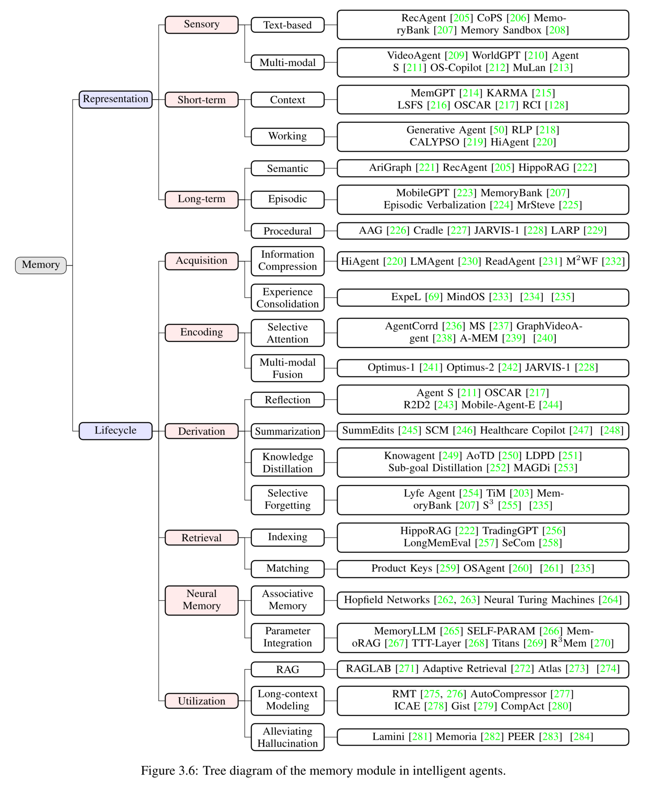
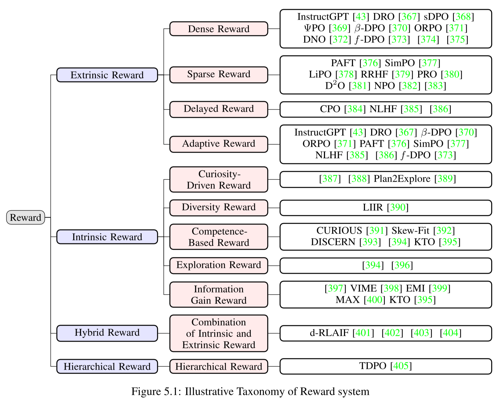
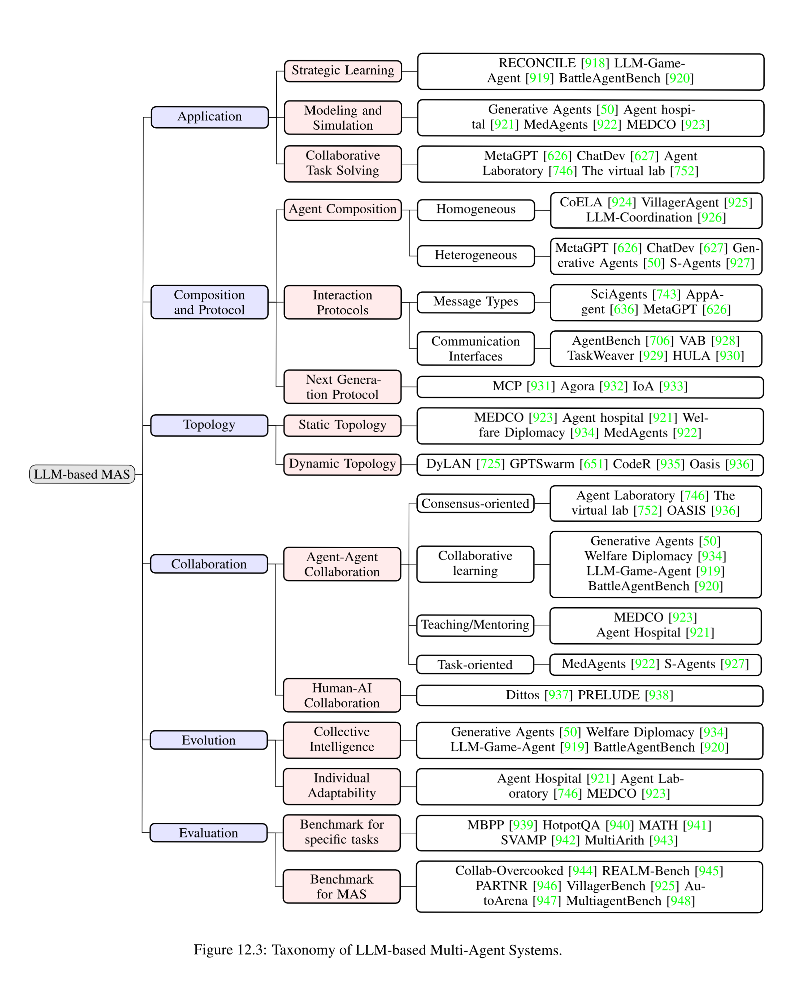
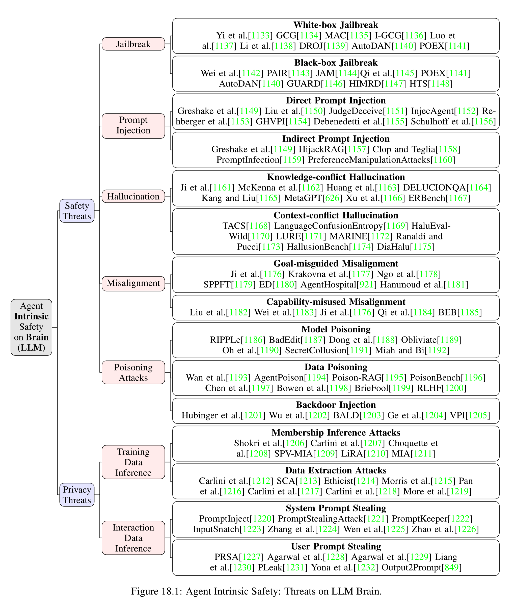

# awesome-foundation-agents

We maintains a curated collection of papers exploring the path towards Foundation Agents, with a focus on formulating the core concepts and navigating the research landscape.

## Our Works Towards Foundation Agents

✨✨✨ [Advances and Challenges in Foundation Agents]() (Paper)

    
    

# Awesome Papers

<b> Table of Contents </b> 

- [Core Components of Intelligent Agents](#core-components-of-intelligent-agents)
    - [Cognition](#cognition)
    - [Memory](#memory)
    - [Perception](#perception)
    - [World Model](#world-model)
    - [Action](#action)
    - [Reward](#reward)
    - [Emotion](#emotion)
- [Self-Enhancement in Intelligent Agents](#self-enhancement-in-intelligent-agents)
- [Collaborative and Evolutionary Intelligent Systems](#collaborative-and-evolutionary-intelligent-systems)
- [Building Safe and Beneficial AI](#building-safe-and-beneficial-ai)

* 🔥 **[MetaGPT](https://github.com/geekan/MetaGPT)** - *DeepWisdom, Jan 2025*  
  
  
  
    
  > The Multi-Agent Framework: First AI Software Company, Towards Natural Language Programming

# Core Components of Intelligent Agents

## Cognition

    

### Learning
#### Space
##### Full
- SFT (Wei et al., 2021)
- PEFT (Houlsby et al., 2019)
- RLHF (Ouyang et al., 2022)
- ReFT (Luong et al., 2024)
- Agentic Models (Song et al., 2025)

##### Partial
- CoT (Wei et al., 2022)
- Voyager (Wang et al., 2023)
- Reflexion (Shinn et al., 2023)
- ActRe (Yang et al., 2024)
- Generative Agents (Park et al., 2023)

#### Objective
##### Perception
- CLIP (Alec et al., 2021)
- LLaVA (Liu et al., 2023)
- CogVLM (Wang et al., 2025)
- Qwen-Audio (Chu et al., 2024)
- R1-Searcher (Song et al., 2025)
- Search-R1 (Jin et al., 2025)

##### Reasoning
- SKY-32B (2025)
- Open Thoughts
- LIMO (Ye et al., 2025)
- STaR (Zelikman et al., 2022)
- ReST (Gulcehre et al., 2023)
- OpenR (Wang et al., 2024)
- LLaMA-Berry (Zhang et al., 2024)
- RAGEN (Wang et al., 2025)
- OpenR1 (2024)

##### World
- Inner Monologue (Huang et al., 2023)
- DESP (Wang et al., 2023)
- Self-refine (Madaan et al., 2024)
- CRITIC (Gou et al.)
- Reflexion (Shinn et al., 2023)
- ExpeL (Zhao et al., 2024)

### Reasoning
#### Structured
##### Dynamic
- ReAct (Yao et al., 2022)
- MCoT (Yang et al., 2024)
- ToT (Yao et al.)
- LATS (Zhou et al., 2024)
- RAP (Hao et al., 2023)
- GoT (Besta et al., 2023)
- PoT (Zhang et al., 2024)
- DoT (Zhang et al., 2024)

##### Static
- Self-Consistency (Wang et al., 2023)
- Self-refine (Madaan et al., 2024)
- PHP (Zheng et al., 2023)
- Self-Verification (Stechly et al., 2024)
- CoVe (Dhuliawala et al., 2024)

##### Domain
- MathPrompter (Imani et al., 2023)
- PedCoT (Jiang et al., 2024)
- Physics Reasoner (Pang et al., 2025)

#### Unstructured
##### Prompt
- CoT (Wei et al., 2022)
- Step-Back (Zheng et al.)
- Ask Me Anything (Arora et al., 2022)
- CoK (Li et al., 2023)
- SEK (Fan et al., 2024)

##### Model
- DeepSeek-R1 (Guo et al., 2025)
- Claude 3.7 Sonnet (Anthropic, 2023)
- o1 (Jaech et al., 2024)

##### Implicit
- Quiet-STaR (Zelikman et al., 2024)
- Coconut (Hao et al., 2024)

#### Planning
- DEPS (Wang et al., 2023)
- ProgPrompt (Singh et al., 2023)
- ADaPT (Prasad et al., 2023)
- ToT (Yao et al.)
- RAP (Hao et al., 2023)
- TravelPlanner (Xie et al., 2024)
- PDDL (McDermott et al., 1998)
- Mind2Web (Deng et al., 2024)

## Reasoning

## Memory

    

### 1. Representation

#### 1.1 Sensory
##### 1.1.1 Text-based
- RecAgent (Wang et al., 2023)
- CoPS (Zhou et al., 2024)
- MemoryBank (Zhong et al., 2024)
- Memory Sandbox (Huang et al., 2023)

##### 1.1.2 Multi-modal
- VideoAgent (Fan et al., 2024)
- WorldGPT (Ge et al., 2024)
- Agent S (Agashe et al., 2024)
- OS-Copilot (Wu et al., 2024)
- MuLan (Li et al., 2024)

#### 1.2 Short-term
##### 1.2.1 Context
- MemGPT (Packer et al., 2023)
- KARMA (Wang et al., 2024)
- LSFS (Shi et al., 2024)
- OSCAR (Wang et al., 2024)
- RCI (Geunwoo et al., 2023)

##### 1.2.2 Working
- Generative Agent (Park et al., 2023)
- RLP (Fischer et al., 2023)
- CALYPSO (Zhu et al., 2023)
- HiAgent (Hu et al., 2024)

#### 1.3 Long-term
##### 1.3.1 Semantic
- AriGraph (Anokhin et al., 2024)
- RecAgent (Wang et al., 2023)
- HippoRAG (Gutierrez et al., 2024)

##### 1.3.2 Episodic
- MobileGPT (Lee et al., 2023)
- MemoryBank (Zhong et al., 2024)
- Episodic Verbalization (Barmann et al., 2024)
- MrSteve (Park et al., 2024)

##### 1.3.3 Procedural
- AAG (Roth et al., 2024)
- Cradle (Tan et al., 2024)
- JARVIS-1 (Wang et al., 2024)
- LARP (Yan et al., 2023)

### 2. Lifecycle

#### 2.1 Acquisition
##### 2.1.1 Information Compression
- HiAgent (Hu et al., 2024)
- LMAgent (Liu et al., 2024)
- ReadAgent (Lee et al., 2024)
- M²WF (Wang et al., 2025)

##### 2.1.2 Experience Consolidation
- ExpeL (Zhao et al., 2024)
- MindOS (Hu et al., 2025)
- Vanschoren et al. (2018)
- Hou et al. (2024)

#### 2.2 Encoding
##### 2.2.1 Selective Attention
- AgentCorrd (Pan et al., 2024)
- MS (Gao et al., 2024)
- GraphVideoAgent (Chu et al., 2025)
- A-MEM (Xu et al., 2025)
- Ali et al. (2024)

##### 2.2.2 Multi-modal Fusion
- Optimus-1 (Li et al., 2024)
- Optimus-2 (Li et al., 2025)
- JARVIS-1 (Wang et al., 2024)

#### 2.3 Derivation
##### 2.3.1 Reflection
- Agent S (Agashe et al., 2024)
- OSCAR (Wang et al., 2024)
- R2D2 (Huang et al., 2025)
- Mobile-Agent-E (Wang et al., 2025)

##### 2.3.2 Summarization
- SummEdits (Laban et al., 2023)
- SCM (Wang et al., 2023)
- Healthcare Copilot (Ren et al., 2024)
- Wang et al. (2023)

##### 2.3.3 Knowledge Distillation
- Knowagent (Zhu et al., 2024)
- AoTD (Shi et al., 2024)
- LDPD (Liu et al., 2024)
- Sub-goal Distillation (Hashemzadeh et al., 2024)
- MAGDi (Chen et al., 2024)

##### 2.3.4 Selective Forgetting
- Lyfe Agent (Kaiya et al., 2023)
- TiM (Liu et al., 2023)
- MemoryBank (Zhong et al., 2024)
- S³ (Gao et al., 2023)
- Hou et al. (2024)

#### 2.4 Retrieval
##### 2.4.1 Indexing
- HippoRAG (Gutierrez et al., 2024)
- TradingGPT (Li et al., 2023)
- LongMemEval (Wu et al., 2024)
- SeCom (Pan et al., 2025)

##### 2.4.2 Matching
- Product Keys (Lample et al., 2019)
- OSAgent (Xu et al., 2024)
- Bahdanau et al. (2014)
- Hou et al. (2024)

#### 2.5 Neural Memory
##### 2.5.1 Associative Memory
- Hopfield Networks (Demircigil et al., 2017; Ramsauer et al., 2020)
- Neural Turing Machines (Falcon et al., 2022)

##### 2.5.2 Parameter Integration
- MemoryLLM (Wang et al., 2024)
- SELF-PARAM (Wang et al., 2024)
- MemoRAG (Qian et al., 2024)
- TTT-Layer (Sun et al., 2024)
- Titans (Behrouz et al., 2024)
- R³Mem (Wang et al., 2025)

#### 2.6 Utilization
##### 2.6.1 RAG
- RAGLAB (Zhang et al., 2024)
- Adaptive Retrieval (Mallen et al., 2023)
- Atlas (Farahani et al., 2024)
- Yuan et al. (2025)

##### 2.6.2 Long-context Modeling
- RMT (Bulatov et al., 2022, 2023)
- AutoCompressor (Chevalier et al., 2023)
- ICAE (Ge et al., 2023)
- Gist (Mu et al., 2024)
- CompAct (Yoon et al., 2024)

##### 2.6.3 Alleviating Hallucination
- Lamini (Li et al., 2024)
- Memoria (Park et al., 2023)
- PEER (He et al., 2024)
- Ding et al. (2024)

## Perception

    

## World Model

## Action

    

### Action Space:

### Language

#### Text

- **ReAct: Synergizing Reasoning and Acting in Language Models**, ICLR 2023, [[paper](https://arxiv.org/abs/2210.03629)] [[code](https://github.com/ysymyth/ReAct)]

- **AutoGPT: Build, Deploy, and Run AI Agents**, Github, [[code](https://github.com/Significant-Gravitas/AutoGPT)]

- **Reflexion: Language Agents with Verbal Reinforcement Learning**, NeurIPS 2023, [[paper](https://arxiv.org/abs/2303.11366)] [[code](https://github.com/noahshinn/reflexion)]

- **LLM+P: Empowering Large Language Models with Optimal Planning Proficiency**, arXiv 2023, [[paper](https://arxiv.org/abs/2304.11477)] [[code](https://github.com/Cranial-XIX/llm-pddl)]

#### Code

- **MetaGPT: Meta Programming for A Multi-Agent Collaborative Framework**, ICLR 2023, [[paper](https://arxiv.org/abs/2308.00352)] [[code](https://github.com/geekan/MetaGPT)]

- **ChatDev: Communicative Agents for Software Development**, ACL 2024, [[paper](https://arxiv.org/abs/2307.07924)] [[code](https://github.com/OpenBMB/ChatDev)]

- **SWE-agent: Agent-Computer Interfaces Enable Automated Software Engineering**, NeurIPS 2025, [[paper](https://arxiv.org/abs/2405.15793)] [[code](https://github.com/SWE-agent/SWE-agent)]

- **OpenHands: An Open Platform for AI Software Developers as Generalist Agents**, arXiv 2024, [[paper](https://arxiv.org/abs/2407.16741)] [[code](https://github.com/All-Hands-AI/OpenHands)]
- 
#### Chat

- **Generative Agents: Interactive Simulacra of Human Behavior**, UIST 2023, [[paper](https://arxiv.org/abs/2304.03442)] [[code](https://github.com/joonspk-research/generative_agents)]

- **AutoGen: Enabling Next-Gen LLM Applications via Multi-Agent Conversation**, COLM 2024, [[paper](https://arxiv.org/abs/2308.08155)] [[code](https://github.com/microsoft/autogen)]

### Digital

#### Game

- **MineDojo: Building Open-Ended Embodied Agents with Internet-Scale Knowledge**, NeurIPS 2022, [[paper](https://arxiv.org/abs/2206.08853)] [[code](https://github.com/MineDojo/MineDojo)]
  
- **Voyager: An Open-Ended Embodied Agent with Large Language Models**, TMLR 2024, [[paper](https://arxiv.org/abs/2305.16291)] [[code](https://github.com/MineDojo/Voyager)]

- **SwarmBrain: Embodied agent for real-time strategy game StarCraft II via large language models**, arXiv 2024, [[paper](https://arxiv.org/abs/2401.17749)] [[code](https://github.com/ramsayxiaoshao/SwarmBrain)]

- **JARVIS-1: Open-World Multi-task Agents with Memory-Augmented Multimodal Language Models**, NeurIPS 2025, [[paper](https://arxiv.org/abs/2311.05997)] [[code](https://github.com/CraftJarvis/JARVIS-1)]

#### Multimodal

- **MM-REACT: Prompting ChatGPT for Multimodal Reasoning and Action**, arXiv 2023, [[paper](https://arxiv.org/abs/2303.11381)] [[code](https://github.com/microsoft/MM-REACT)]

- **ViperGPT: Visual Inference via Python Execution for Reasoning**, ICCV 2023, [[paper](https://arxiv.org/abs/2303.08128)] [[code](https://github.com/cvlab-columbia/viper)]

- **Visual ChatGPT: Talking, Drawing and Editing with Visual Foundation Models**, arXiv 2023, [[paper](https://arxiv.org/abs/2303.04671)] [[code](https://github.com/hackiey/visual-chatgpt)]

- **HuggingGPT: Solving AI Tasks with ChatGPT and its Friends in Hugging Face**, NeurIPS 2023, [[paper](https://arxiv.org/pdf/2303.17580)] [[code](https://github.com/AI-Chef/HuggingGPT)]

#### Web

- **WebGPT: Browser-assisted question-answering with human feedback**, arXiv 2021, [[paper](https://arxiv.org/abs/2112.09332)] [[blog](https://openai.com/index/webgpt/)]

- **WebShop: Towards Scalable Real-World Web Interaction with Grounded Language Agents**, NeurIPS 2022, [[paper](https://arxiv.org/abs/2207.01206)] [[code](https://github.com/princeton-nlp/WebShop)]

- **A Real-World WebAgent with Planning, Long Context Understanding, and Program Synthesis**, ICLR 2024, [[paper](https://arxiv.org/abs/2307.12856)]

- **Mind2Web: Towards a Generalist Agent for the Web**, NeurIPS 2025, [[paper](https://arxiv.org/abs/2306.06070)] [[code](https://github.com/OSU-NLP-Group/Mind2Web)]

#### GUI

- **Mobile-Agent: Autonomous Multi-Modal Mobile Device Agent with Visual Perception**, arXiv 2024, [[paper](https://arxiv.org/abs/2401.16158)] [[code](https://github.com/X-PLUG/MobileAgent)]

- **AppAgent: Multimodal Agents as Smartphone Users**, arXiv 2023, [[paper](https://arxiv.org/abs/2312.13771)] [[code](https://github.com/TencentQQGYLab/AppAgent)]

- **UFO: A UI-Focused Agent for Windows OS Interaction**, arXiv 2024, [[paper](https://arxiv.org/abs/2402.07939)] [[code](https://github.com/microsoft/UFO)]

- **OmniParser for Pure Vision Based GUI Agent**, arXiv 2024, [[paper](https://arxiv.org/abs/2408.00203)] [[code](https://github.com/microsoft/OmniParser)]

#### DB & KG

- **UnifiedSKG: Unifying and Multi-Tasking Structured Knowledge Grounding with Text-to-Text Language Models**, EMNLP 2022, [[paper](https://arxiv.org/abs/2201.05966)] [[code](https://github.com/xlang-ai/UnifiedSKG)]

- **Don't Generate, Discriminate: A Proposal for Grounding Language Models to Real-World Environments**, ACL 2023, [[paper](https://arxiv.org/abs/2212.09736)] [[code](https://github.com/dki-lab/Pangu)]

- **Can LLM Already Serve as A Database Interface? A BIg Bench for Large-Scale Database Grounded Text-to-SQLs**, NeurIPS 2025, [[paper](https://arxiv.org/pdf/2305.03111)] [[project](https://bird-bench.github.io/)]

- **Spider 2.0: Evaluating language models on real-world enterprise text-to-sql workflows.**, ICLR 2025, [[paper](https://arxiv.org/abs/2411.07763)] [[code](https://github.com/xlang-ai/Spider2)]

- **Middleware for llms: Tools are instrumental for language agents in complex environments.**, EMNLP 2024, [[paper](https://arxiv.org/abs/2402.14672)] [[code](https://github.com/OSU-NLP-Group/Middleware)]

### Physical

- **RT-1: Robotics Transformer for Real-World Control at Scale**, RSS 2023, [[paper](https://arxiv.org/abs/2212.06817)] [[project](https://robotics-transformer1.github.io/)]

- **RT-2: Vision-Language-Action Models Transfer Web Knowledge to Robotic Control**, CoRL 2023, [[paper](https://arxiv.org/abs/2307.15818)] [[project](https://robotics-transformer2.github.io/)]

- **Open X-Embodiment: Robotic Learning Datasets and RT-X Models**, arXiv 2023, [[paper](https://arxiv.org/abs/2310.08864v4)] [[project](https://robotics-transformer-x.github.io/)]
  
- **GR-2: A Generative Video-Language-Action Model with Web-Scale Knowledge for Robot Manipulation**, arXiv 2024, [[paper](https://arxiv.org/abs/2410.06158)] [[project](https://gr2-manipulation.github.io/)]
  
- **π0: A vision-language-action flow model for general robot control.**, arXiv 2024, [[paper](https://arxiv.org/abs/2410.24164)]

- **Do as I can, not as I say Grounding language in robotic affordances**, CoRL 2022, [[paper](https://arxiv.org/abs/2204.01691)] [[project](https://say-can.github.io/)]

- **Voxposer: Composable 3d value maps for robotic manipulation with language models.**, CoRL 2023, [[paper](https://arxiv.org/abs/2307.05973)] [[code](https://github.com/huangwl18/VoxPoser)]

- **Embodiedgpt: Vision-language pre-training via embodied chain of thought.**, NeurIPS 2023, [[paper](https://arxiv.org/abs/2305.15021)] [[project](https://embodiedgpt.github.io/)]

### Learning

### ICL (In-Context Learning)

#### Prompt

- **CoT**, Details to be added

- **ReAct**, arXiv, 2022 [[paper](https://arxiv.org/abs/2210.03629)]

- **Auto-CoT**, Details to be added

- **ToT**, Details to be added

- **GoT**, Details to be added

- **CoA**, Details to be added

#### Decompose

- **Least-to-Most**, Details to be added

- **HuggingGPT**, Details to be added

- **Plan-and-Solve**, Details to be added

- **ProgPrompt**, Details to be added

#### Role-play

- **Generative Agents**, Details to be added

- **MetaGPT**, Details to be added

- **ChatDev**, Details to be added

- **SWE-Agent**, Details to be added

#### Refine

- **Reflexion**, arXiv, 2023 [[paper](https://arxiv.org/abs/2303.11366)]

- **Self-refine**, Details to be added

- **GPTSwarm**, Details to be added

### PT & SFT (Pre-Training & Supervised Fine-Tuning)

#### Pre-Train

- **RT-1**, Details to be added

- **RT-2**, Details to be added

- **RT-X**, Details to be added

- **GR-2**, Details to be added

- **LAM**, Details to be added

#### SFT

- **LearnAct**, Details to be added

- **CogACT**, Details to be added

- **RT-H**, Details to be added

- **OpenVLA**, Details to be added

- **GR-2**, Details to be added

- **πo**, Details to be added

- **UniAct**, Details to be added

### RL (Reinforcement Learning)

- **RLHF**, Details to be added

- **DPO**, Details to be added

- **RLFP**, Details to be added

- **ELLM**, Details to be added

- **GenSim**, Details to be added

- **LEA**, Details to be added

- **MLAQ**, Details to be added

- **KALM**, Details to be added

- **When2Ask**, Details to be added

- **Eureka**, Details to be added

- **ArCHer**, Details to be added

- **LLaRP**, Details to be added

- **GPTSwarm**, Details to be added

## Reward

    

## Emotion

# Self-Enhancement in Intelligent Agents

    

# Collaborative and Evolutionary Intelligent Systems

    

## Application
### Strategic Learning
- RECONCILE (Chen et al., 2023)
- LLM-Game-Agent (Lan et al., 2023)
- BattleAgentBench (Wang et al., 2024)

### Modeling and Simulation
- Generative Agents (Park et al., 2023)
- Agent Hospital (Li et al., 2024)
- MedAgents (Tang et al., 2024)
- MEDCO (Wei et al., 2024)

### Collaborative Task Solving
- MetaGPT (Hong et al., 2023)
- ChatDev (Qian et al., 2024)
- Agent Laboratory (Schmidgall et al., 2025)
- The Virtual Lab (Swanson et al., 2024)

## Composition and Protocol
### Agent Composition
#### Homogeneous
- CoELA (Zhang et al., 2023)
- VillagerAgent (Dong et al., 2024)
- LLM-Coordination (Agashe et al., 2024)

#### Heterogeneous
- MetaGPT (Hong et al., 2023)
- ChatDev (Qian et al., 2024)
- Generative Agents (Park et al., 2023)
- S-Agents (Chen et al., 2024)

### Interaction Protocols
#### Message Types
- SciAgents (Ghafarollahi et al., 2024)
- AppAgent (Chi et al., 2023)
- MetaGPT (Hong et al., 2023)

#### Communication Interfaces
- AgentBench (Liu et al., 2023)
- VAB (Liu et al., 2024)
- TaskWeaver (Qiao et al., 2024)
- HULA (Takerngsaksiri et al., 2025)

### Next Generation Protocol
- MCP (Anthropic)
- Agora (Marro et al., 2024)
- IoA (Chen et al., 2024)

## Topology
### Static Topology
- MEDCO (Wei et al., 2024)
- Agent Hospital (Li et al., 2024)
- Welfare Diplomacy (Mukobi et al., 2023)
- MedAgents (Tang et al., 2024)

### Dynamic Topology
- DyLAN (Liu et al., 2023)
- GPTSwarm (Zhuge et al., 2024)
- CodeR (Chen et al., 2024)
- Oasis (Yang et al., 2024)

## Collaboration
### Agent-Agent Collaboration
#### Consensus-oriented
- Agent Laboratory (Schmidgall et al., 2025)
- The Virtual Lab (Swanson et al., 2024)
- OASIS (Yang et al., 2024)

#### Collaborative Learning
- Generative Agents (Park et al., 2023)
- Welfare Diplomacy (Mukobi et al., 2023)
- LLM-Game-Agent (Lan et al., 2023)
- BattleAgentBench (Wang et al., 2024)

#### Teaching/Mentoring
- MEDCO (Wei et al., 2024)
- Agent Hospital (Li et al., 2024)

#### Task-oriented
- MedAgents (Tang et al., 2024)
- S-Agents (Chen et al., 2024)

### Human-AI Collaboration
- Dittos (Leong et al., 2024)
- PRELUDE (Gao et al., 2024)

## Evolution
### Collective Intelligence
- Generative Agents (Park et al., 2023)
- Welfare Diplomacy (Mukobi et al., 2023)
- LLM-Game-Agent (Lan et al., 2023)
- BattleAgentBench (Wang et al., 2024)

### Individual Adaptability
- Agent Hospital (Li et al., 2024)
- Agent Laboratory (Schmidgall et al., 2025)
- MEDCO (Wei et al., 2024)

## Evaluation
### Benchmark for Specific Tasks
- MBPP (dataset-mbpp)
- HotpotQA (dataset-hotpot-qa)
- MATH (dataset-math)
- SVAMP (dataset-svamp)
- MultiArith (dataset-multiarith)

### Benchmark for MAS
- Collab-Overcooked (Sun et al., 2025)
- REALM-Bench (Geng et al., 2025)
- PARTNR (Chang et al., 2024)
- VillagerBench (Dong et al., 2024)
- AutoArena (Zhao et al., 2024)
- MultiagentBench (Zhu et al., 2025)

# Building Safe and Beneficial AI

    

