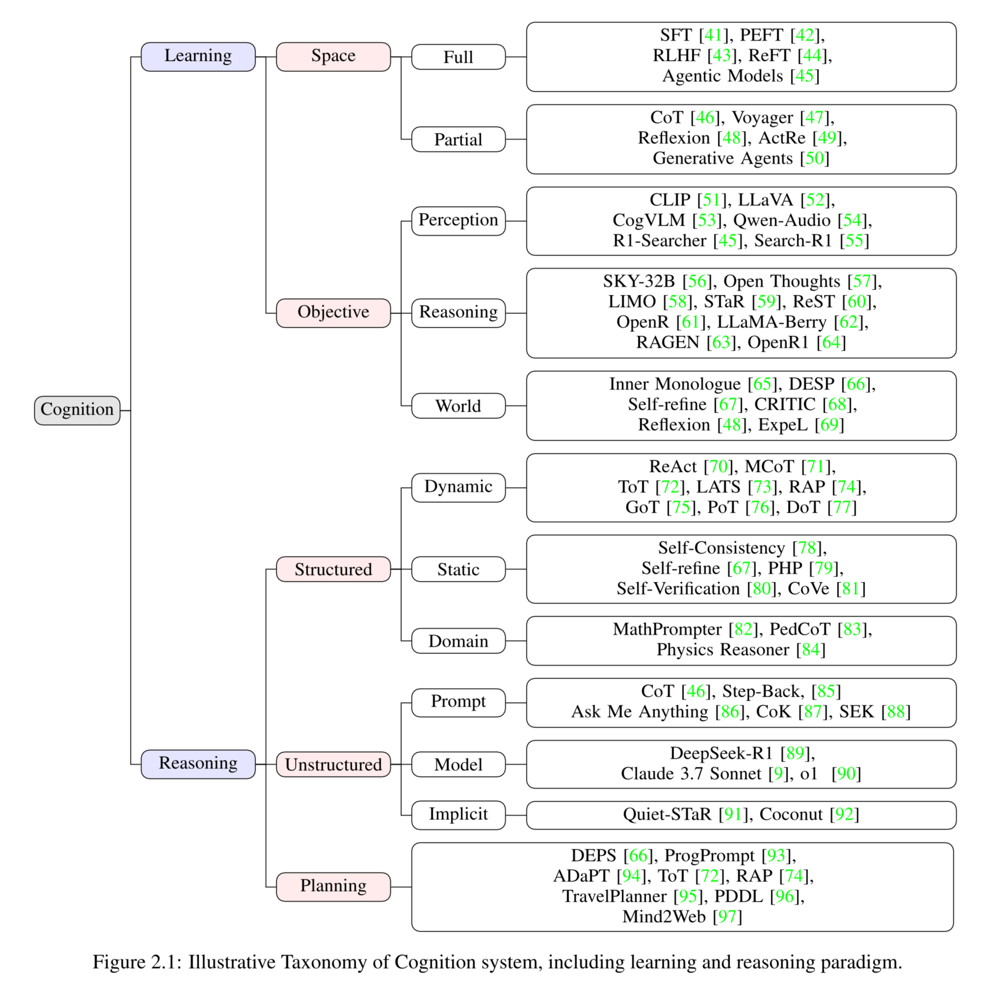
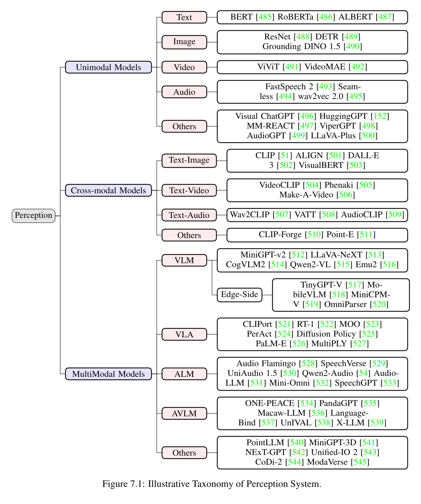
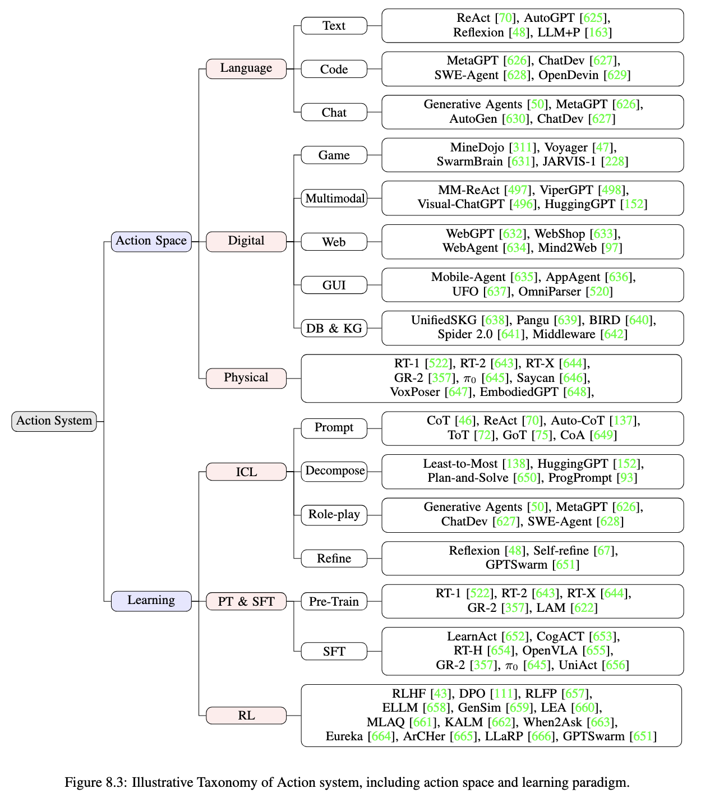
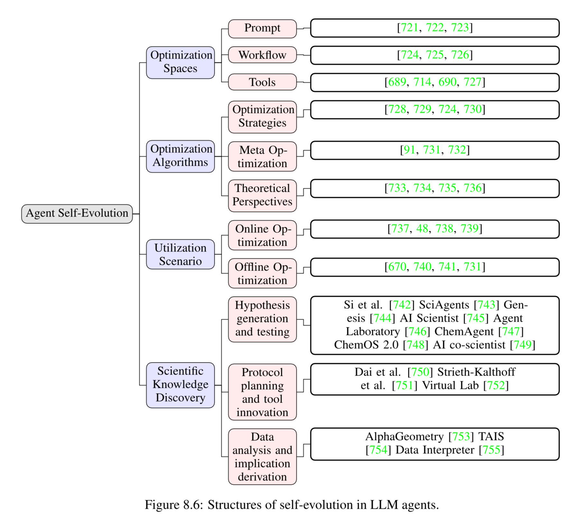
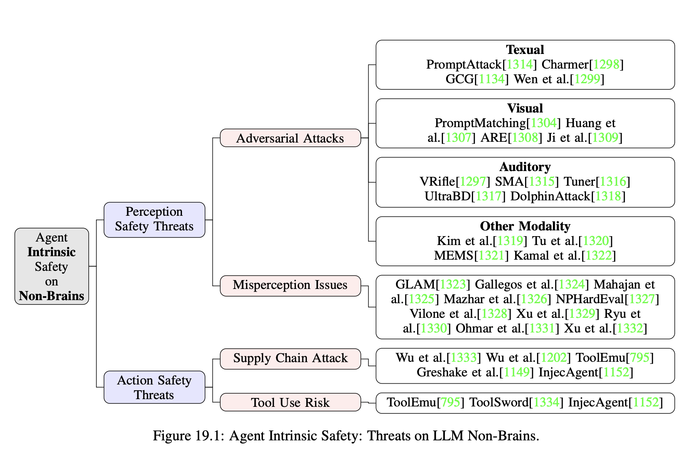

# Awesome-Foundation-Agents

We maintain a curated collection of papers exploring the path towards Foundation Agents, with a focus on formulating the core concepts and navigating the research landscape.

⌛️ Coming soon: Version 2! We're continuously compiling and updating cutting-edge insights. Feel free to suggest any related work you find valuable!

## Our Works Towards Foundation Agents

✨✨✨ [Advances and Challenges in Foundation Agents](https://www.arxiv.org/abs/2504.01990) (Paper)

# Awesome Papers

<b> Table of Contents </b> 

- [Core Components of Intelligent Agents](#core-components-of-intelligent-agents)
    - [Cognition](#cognition)
    - [Memory](#memory)
    - [Perception](#perception)
    - [World Model](#world-model)
    - [Action](#action)
    - [Reward](#reward)
    - [Emotion](#emotion)
- [Self-Enhancement in Intelligent Agents](#self-enhancement-in-intelligent-agents)
- [Collaborative and Evolutionary Intelligent Systems](#collaborative-and-evolutionary-intelligent-systems)
- [Building Safe and Beneficial AI](#building-safe-and-beneficial-ai)

# Core Components of Intelligent Agents

## Cognition

    

### Learning
#### Space
##### Full
- **Add SFT,RLHF,PEFT**
- **ReFT: Reasoning with Reinforced Fine-Tuning**, arxiv 2024, [[paper]()] [[code]()]
- **Search-R1: Training LLMs to Reason and Leverage Search Engines with Reinforcement Learning** [[paper](https://arxiv.org/abs/2503.09516)] [[code](https://github.com/PeterGriffinJin/Search-R1)]
- **R1-Searcher: Incentivizing the Search Capability in LLMs via Reinforcement Learning**, arxiv 2025, [[paper]()] [[code]()]

##### Partial
- **Chain-of-Thought Prompting Elicits Reasoning in Large Language Models**, Wei et al. 2022, [[paper](https://arxiv.org/abs/2201.11903)] [[code]()]
- **Voyager: An Open-Ended Embodied Agent with Large Language Models**, arxiv 2023, [[paper](https://arxiv.org/abs/2305.16291)] [[code]()]
- **Reflexion: Language Agents with Verbal Reinforcement Learning**, NeurIPS 2023, [[paper](https://arxiv.org/abs/2303.11366)] [[code]()]
- **ReAct meets ActRe: Autonomous Annotations of Agent Trajectories for Contrastive Self-Training**, arxiv 2024, [[paper](https://arxiv.org/abs/2403.14589)] [[code]()]
- **Generative Agents: Interactive Simulacra of Human Behavior**, ACM UIST 2023, [[paper](https://arxiv.org/abs/2304.03442)] [[code]()]

#### Objective
##### Perception
- **CLIP: Learning Transferable Visual Models from Natural Language Supervision**, ICML 2021, [[paper](https://arxiv.org/abs/2103.00020)] [[code]()]
- **LLaVA: Visual Instruction Tuning**, NeurIPS 2023, [[paper](https://arxiv.org/abs/2304.08485)] [[code]()]
- **CogVLM: Visual Expert for Pretrained Language Models**, NeurIPS 2025, [[paper](https://arxiv.org/abs/2311.03079)] [[code]()]
- **Qwen2-Audio Technical Report**, arxiv 2024, [[paper]()] [[code]()]
- **Search-R1: Training LLMs to Reason and Leverage Search Engines with Reinforcement Learning**, arxiv 2025, [[paper]()] [[code]()]

##### Reasoning
- **SKY-T1: Train Your Own o1 Preview Model Within $450**, 2025, [[paper]()] [[code]()]
- **Open Thoughts**, 2025, [[paper]()] [[code]()]
- **LIMO: Less is More for Reasoning**, arxiv 2025, [[paper]()] [[code]()]
- **STaR: Bootstrapping Reasoning with Reasoning**, arxiv 2022, [[paper]()] [[code]()]
- **ReST: Reinforced Self-Training for Language Modeling**, arxiv 2023, [[paper](https://arxiv.org/abs/2308.08998)] [[code]()]
- **OpenR: An Open Source Framework for Advanced Reasoning with Large Language Models**, arxiv 2024, [[paper]()] [[code]()]
- **LLaMA-Berry: Pairwise Optimization for o1-like Olympiad-level Mathematical Reasoning**, arxiv 2024, [[paper]()] [[code]()]
- **RAGEN: Training Agents by Reinforcing Reasoning**, arxiv 2025, [[paper]()] [[code]()]
- **Open-R1**, 2024, [[paper]()] [[code]()]

##### World
- **Inner Monologue: Embodied Reasoning through Planning with Language Models**, CoRL 2023, [[paper](https://arxiv.org/abs/2207.05608)] [[code]()]
- **Self-Refine: Iterative Refinement with Self-Feedback**, NeurIPS 2024, [[paper](https://arxiv.org/abs/2303.17651)] [[code]()]
- **Reflexion: Language Agents with Verbal Reinforcement Learning**, NeurIPS 2023, [[paper](https://arxiv.org/abs/2303.11366)] [[code]()]
- **ExpeL: LLM Agents Are Experiential Learners**, AAAI 2024, [[paper](https://arxiv.org/abs/2308.10144)] [[code]()]
- **AutoManual: Generating Instruction Manuals by LLM Agents via Interactive Environmental Learning**, arxiv 2024, [[paper](https://arxiv.org/abs/2405.16247)] [[code]()]
- **ReAct meets ActRe: Autonomous Annotations of Agent Trajectories for Contrastive Self-Training**, arxiv 2024, [[paper](https://arxiv.org/abs/2403.14589)] [[code]()]

### Reasoning
#### Structured
##### Dynamic
- **ReAct: Synergizing Reasoning and Acting in Language Models**, arxiv 2022, [[paper](https://arxiv.org/abs/2210.03629)] [[code]()]
- **Markov Chain of Thought for Efficient Mathematical Reasoning**, arxiv 2024, [[paper]()] [[code]()]
- **Tree of Thoughts: Deliberate Problem Solving with Large Language Models**, NeurIPS 2023, [[paper](https://arxiv.org/abs/2305.10601)] [[code]()]
- **Language Agent Tree Search Unifies Reasoning, Acting, and Planning in Language Models**, ICML 2024, [[paper](https://arxiv.org/abs/2310.04406)] [[code]()]
- **Reasoning via Planning (RAP): Improving Language Models with World Models**, EMNLP 2023, [[paper](https://arxiv.org/abs/2305.14992)] [[code]()]
- **Graph of Thoughts: Solving Elaborate Problems with Large Language Models**, AAAI 2023, [[paper](https://arxiv.org/abs/2308.09687)] [[code]()]
- **Path of Thoughts: Extracting and Following Paths for Robust Relational Reasoning with Large Language Models**, arxiv 2024, [[paper]()] [[code]()]
- **On the Diagram of Thought**, arxiv 2024, [[paper]()] [[code]()]

##### Static
- **Self-Consistency Improves Chain of Thought Reasoning in Language Models**, ICLR 2023, [[paper](https://arxiv.org/abs/2203.11171)] [[code]()]
- **Self-Refine: Iterative Refinement with Self-Feedback**, NeurIPS 2024, [[paper](https://arxiv.org/abs/2303.17651)] [[code]()]
- **Progressive-Hint Prompting Improves Reasoning in Large Language Models**, arxiv 2023, [[paper](https://arxiv.org/abs/2304.09797)] [[code]()]
- **On the Self-Verification Limitations of Large Language Models on Reasoning and Planning Tasks**, arxiv 2024, [[paper]()] [[code]()]
- **Chain-of-Verification Reduces Hallucination in Large Language Models**, ICLR 2024 Workshop, [[paper](https://arxiv.org/abs/2309.11495)] [[code]()]

##### Domain
- **MathPrompter: Mathematical Reasoning Using Large Language Models**, ACL 2023, [[paper](https://arxiv.org/abs/2303.05398)] [[code]()]
- **LLMs Can Find Mathematical Reasoning Mistakes by Pedagogical Chain-of-Thought**, arxiv 2024, [[paper]()] [[code]()]
- **Physics Reasoner: Knowledge-Augmented Reasoning for Solving Physics Problems with Large Language Models**, COLING 2025, [[paper]()] [[code]()]

#### Unstructured
##### Prompt
- **Chain of Thought Prompting Elicits Reasoning in Large Language Models**, NeurIPS 2022, [[paper](https://arxiv.org/abs/2201.11903)] [[code]()]
- **Take a Step Back: Evoking Reasoning via Abstraction in Large Language Models**, ICLR 2024, [[paper](https://arxiv.org/abs/2310.06117)] [[code]()]
- **Ask Me Anything: A Simple Strategy for Prompting Language Models**, arxiv 2022, [[paper](https://arxiv.org/abs/2210.02441)] [[code]()]
- **Chain-of-Knowledge: Grounding Large Language Models via Dynamic Knowledge Adapting over Heterogeneous Sources**, arxiv 2023, [[paper](https://arxiv.org/abs/2305.13269)] [[code]()]
- **Self-Explained Keywords Empower Large Language Models for Code Generation**, arxiv 2024, [[paper]()] [[code]()]

##### Model
- **DeepSeek-R1: Incentivizing Reasoning Capability in LLMs via Reinforcement Learning**, arxiv 2025, [[paper]()] [[code]()]
- **Claude 3.7 Sonnet**, 2025, [[paper]()] [[code]()]
- **OpenAI o1 System Card**, arxiv 2024, [[paper]()] [[code]()]

##### Implicit
- **Quiet-STaR: Language Models Can Teach Themselves to Think Before Speaking**, arxiv 2024, [[paper](https://arxiv.org/abs/2403.09629)] [[code]()]
- **Chain of Continuous Thought (Coconut): Training Large Language Models to Reason in a Continuous Latent Space**, arxiv 2024, [[paper]()] [[code]()]

#### Planning
- **Describe, Explain, Plan and Select (DEPS): Interactive Planning with Large Language Models**, arxiv 2023, [[paper](https://arxiv.org/abs/2302.01560)] [[code]()]
- **ProgPrompt: Generating Situated Robot Task Plans Using Large Language Models**, ICRA 2023, [[paper](https://arxiv.org/abs/2209.11302)] [[code]()]
- **ADAPT: As-Needed Decomposition and Planning with Language Models**, arxiv 2023, [[paper]()] [[code]()]
- **Tree of Thoughts: Deliberate Problem Solving with Large Language Models**, NeurIPS 2023, [[paper](https://arxiv.org/abs/2305.10601)] [[code]()]
- **Reasoning via Planning (RAP): Improving Language Models with World Models**, EMNLP 2023, [[paper](https://arxiv.org/abs/2305.14992)] [[code]()]
- **TravelPlanner: A Benchmark for Real-World Planning with Language Agents**, ICML 2024, [[paper](https://arxiv.org/abs/2402.01622)] [[code]()]
- **PDDL—The Planning Domain Definition Language**, 1998, [[paper](https://arxiv.org/abs/1106.4561)] [[code]()]
- **Mind2Web: Towards a Generalist Agent for the Web**, NeurIPS 2023, [[paper](https://arxiv.org/abs/2306.06070)] [[code]()]

## Memory

    

### 1. Representation

#### 1.1 Sensory
##### 1.1.1 Text-based
- RecAgent (Wang et al., 2023)
- CoPS (Zhou et al., 2024)
- MemoryBank (Zhong et al., 2024)
- Memory Sandbox (Huang et al., 2023)

##### 1.1.2 Multi-modal
- VideoAgent (Fan et al., 2024)
- WorldGPT (Ge et al., 2024)
- Agent S (Agashe et al., 2024)
- OS-Copilot (Wu et al., 2024)
- MuLan (Li et al., 2024)

#### 1.2 Short-term
##### 1.2.1 Context
- MemGPT (Packer et al., 2023)
- KARMA (Wang et al., 2024)
- LSFS (Shi et al., 2024)
- OSCAR (Wang et al., 2024)
- RCI (Geunwoo et al., 2023)

##### 1.2.2 Working
- Generative Agent (Park et al., 2023)
- RLP (Fischer et al., 2023)
- CALYPSO (Zhu et al., 2023)
- HiAgent (Hu et al., 2024)

#### 1.3 Long-term
##### 1.3.1 Semantic
- AriGraph (Anokhin et al., 2024)
- RecAgent (Wang et al., 2023)
- HippoRAG (Gutierrez et al., 2024)

##### 1.3.2 Episodic
- MobileGPT (Lee et al., 2023)
- MemoryBank (Zhong et al., 2024)
- Episodic Verbalization (Barmann et al., 2024)
- MrSteve (Park et al., 2024)

##### 1.3.3 Procedural
- AAG (Roth et al., 2024)
- Cradle (Tan et al., 2024)
- JARVIS-1 (Wang et al., 2024)
- LARP (Yan et al., 2023)

### 2. Lifecycle

#### 2.1 Acquisition
##### 2.1.1 Information Compression
- HiAgent (Hu et al., 2024)
- LMAgent (Liu et al., 2024)
- ReadAgent (Lee et al., 2024)
- M²WF (Wang et al., 2025)

##### 2.1.2 Experience Consolidation
- ExpeL (Zhao et al., 2024)
- MindOS (Hu et al., 2025)
- Vanschoren et al. (2018)
- Hou et al. (2024)

#### 2.2 Encoding
##### 2.2.1 Selective Attention
- AgentCorrd (Pan et al., 2024)
- MS (Gao et al., 2024)
- GraphVideoAgent (Chu et al., 2025)
- A-MEM (Xu et al., 2025)
- Ali et al. (2024)

##### 2.2.2 Multi-modal Fusion
- Optimus-1 (Li et al., 2024)
- Optimus-2 (Li et al., 2025)
- JARVIS-1 (Wang et al., 2024)

#### 2.3 Derivation
##### 2.3.1 Reflection
- Agent S (Agashe et al., 2024)
- OSCAR (Wang et al., 2024)
- R2D2 (Huang et al., 2025)
- Mobile-Agent-E (Wang et al., 2025)

##### 2.3.2 Summarization
- SummEdits (Laban et al., 2023)
- SCM (Wang et al., 2023)
- Healthcare Copilot (Ren et al., 2024)
- Wang et al. (2023)

##### 2.3.3 Knowledge Distillation
- Knowagent (Zhu et al., 2024)
- AoTD (Shi et al., 2024)
- LDPD (Liu et al., 2024)
- Sub-goal Distillation (Hashemzadeh et al., 2024)
- MAGDi (Chen et al., 2024)

##### 2.3.4 Selective Forgetting
- Lyfe Agent (Kaiya et al., 2023)
- TiM (Liu et al., 2023)
- MemoryBank (Zhong et al., 2024)
- S³ (Gao et al., 2023)
- Hou et al. (2024)

#### 2.4 Retrieval
##### 2.4.1 Indexing
- HippoRAG (Gutierrez et al., 2024)
- TradingGPT (Li et al., 2023)
- LongMemEval (Wu et al., 2024)
- SeCom (Pan et al., 2025)

##### 2.4.2 Matching
- Product Keys (Lample et al., 2019)
- OSAgent (Xu et al., 2024)
- Bahdanau et al. (2014)
- Hou et al. (2024)

#### 2.5 Neural Memory
##### 2.5.1 Associative Memory
- Hopfield Networks (Demircigil et al., 2017; Ramsauer et al., 2020)
- Neural Turing Machines (Falcon et al., 2022)

##### 2.5.2 Parameter Integration
- MemoryLLM (Wang et al., 2024)
- SELF-PARAM (Wang et al., 2024)
- MemoRAG (Qian et al., 2024)
- TTT-Layer (Sun et al., 2024)
- Titans (Behrouz et al., 2024)
- R³Mem (Wang et al., 2025)

#### 2.6 Utilization
##### 2.6.1 RAG
- RAGLAB (Zhang et al., 2024)
- Adaptive Retrieval (Mallen et al., 2023)
- Atlas (Farahani et al., 2024)
- Yuan et al. (2025)

##### 2.6.2 Long-context Modeling
- RMT (Bulatov et al., 2022, 2023)
- AutoCompressor (Chevalier et al., 2023)
- ICAE (Ge et al., 2023)
- Gist (Mu et al., 2024)
- CompAct (Yoon et al., 2024)

##### 2.6.3 Alleviating Hallucination
- Lamini (Li et al., 2024)
- Memoria (Park et al., 2023)
- PEER (He et al., 2024)
- Ding et al. (2024)

## Perception

    

### Unimodal Models

#### Text
- **BERT: Pre-training of Deep Bidirectional Transformers for Language Understanding**, 2018, [[paper](https://arxiv.org/abs/1810.04805)] [[code](https://github.com/google-research/bert)]
- **RoBERTa: A Robustly Optimized BERT Pretraining Approach**, 2019, [[paper](https://arxiv.org/abs/1907.11692)] [[code](https://github.com/facebookresearch/fairseq)]
- **ALBERT: A Lite BERT for Self-supervised Learning of Language Representations** , 2019, [[paper](https://arxiv.org/abs/1909.11942)] [[code](https://github.com/google-research/ALBERT)]

#### Image
- **Deep Residual Learning for Image Recognition**, CVPR 2016, [[paper](https://arxiv.org/abs/1512.03385)] [[code](https://github.com/KaimingHe/deep-residual-networks)]
- **End-to-End Object Detection with Transformers**, 2020, [[paper](https://arxiv.org/abs/2005.12872)] [[code](https://github.com/facebookresearch/detr)]
- **Grounding DINO 1.5: Advance the "Edge" of Open-Set Object Detection**, 2024, [[paper](https://arxiv.org/abs/2405.10300)] [[code](https://github.com/IDEA-Research/Grounding-DINO-1.5-API)]

#### Video
- **ViViT: A Video Vision Transformer**, 2021, [[paper](https://arxiv.org/abs/2103.15691)] [[code](https://github.com/google-research/scenic/tree/main/scenic/projects/vivit)]
- **VideoMAE: Masked Autoencoders are Data-Efficient Learners for Self-Supervised Video Pre-Training**, 2022, [[paper](https://arxiv.org/abs/2203.12602)] [[code](https://github.com/MCG-NJU/VideoMAE)]

#### Audio
- **FastSpeech 2: Fast and High-Quality End-to-End Text to Speech**, 2020, [[paper](https://arxiv.org/abs/2006.04558)] [[code](https://speechresearch.github.io/fastspeech2)]
- **Seamless: Multilingual Expressive and Streaming Speech Translation**, 2023, [[paper](https://arxiv.org/abs/2312.05187)] [[code](https://github.com/facebookresearch/seamless_communication)]
- **wav2vec 2.0: A Framework for Self-Supervised Learning of Speech Representations**, 2020, [[paper](https://arxiv.org/abs/2006.11477)] [[code](https://github.com/facebookresearch/fairseq/tree/main/examples/wav2vec)]

#### Other Unimodal
- **Visual ChatGPT: Talking, Drawing and Editing with Visual Foundation Models**, 2023, [[paper](https://arxiv.org/abs/2303.04671)] [[code](https://github.com/chenfei-wu/TaskMatrix)]
- **HuggingGPT: Solving AI Tasks with ChatGPT and its Friends in Hugging Face**, 2024, [[paper](https://arxiv.org/abs/2303.17580)] [[code](https://github.com/microsoft/JARVIS)]
- **MM-REACT: Prompting ChatGPT for Multimodal Reasoning and Action**, 2023, [[paper](https://arxiv.org/abs/2303.11381)] [[code](https://github.com/microsoft/MM-REACT)]
- **ViperGPT: Visual Inference via Python Execution for Reasoning**, 2023, [[paper](https://arxiv.org/abs/2303.08128)] [[code](https://github.com/cvlab-columbia/viper)]
- **AudioGPT: Understanding and Generating Speech, Music, Sound, and Talking Head**, 2024, [[paper](https://arxiv.org/abs/2304.12995)] [[code](https://github.com/AIGC-Audio/AudioGPT)]
- **LLaVA-Plus: Learning to Use Tools for Creating Multimodal Agents**, 2025, [[paper](https://arxiv.org/abs/2311.05437)] [[code](https://github.com/LLaVA-VL/LLaVA-Plus-Codebase)]

### Cross-modal Models

#### Text-Image
- **Learning Transferable Visual Models From Natural Language Supervision**, 2021, [[paper](https://arxiv.org/abs/2103.00020)] [[code](https://github.com/OpenAI/CLIP)]
- **Scaling Up Visual and Vision-Language Representation Learning With Noisy Text Supervision** , 2021, [[paper](https://arxiv.org/abs/2102.05918)]
- **Improving Image Generation with Better Captions**, 2023, [[paper](https://cdn.openai.com/papers/dall-e-3.pdf)]
- **VisualBERT: A Simple and Performant Baseline for Vision and Language**, 2019, [[paper](https://arxiv.org/abs/1908.03557)] [[code](https://github.com/uclanlp/visualbert)]

#### Text-Video
- **VideoCLIP: Contrastive Pre-training for Zero-shot Video-Text Understanding**, 2021, [[paper](https://arxiv.org/abs/2109.14084)] [[code](https://github.com/facebookresearch/fairseq/tree/main/examples/MMPT)]
- **Phenaki: Variable Length Video Generation From Open Domain Textual Description**, 2022, [[paper](https://arxiv.org/abs/2210.02399)] [[code](https://phenaki.github.io/)]
- **Make-A-Video: Text-to-Video Generation without Text-Video Data**, 2022, [[paper](https://arxiv.org/abs/2209.14792)] [[code](https://make-a-video.github.io/)]

#### Text-Audio
- **Wav2CLIP: Learning Robust Audio Representations From CLIP**, 2022, [[paper](https://arxiv.org/abs/2110.11499)] [[code](https://github.com/descriptinc/lyrebird-wav2clip)]
- **VATT: Transformers for Multimodal Self-Supervised Learning from Raw Video, Audio and Text**, 2021, [[paper](https://arxiv.org/abs/2104.11178)] [[code](https://github.com/google-research/google-research/tree/master/vatt)]
- **AudioCLIP: Extending CLIP to Image, Text and Audio** , 2022, [[paper](https://arxiv.org/abs/2106.13043)] [[code](https://github.com/AndreyGuzhov/AudioCLIP)]

#### Other Cross-modal
- **CLIP-Forge: Towards Zero-Shot Text-to-Shape Generation**, 2022, [[paper](https://arxiv.org/abs/2110.02624)] [[code](https://github.com/AutodeskAILab/Clip-Forge)]
- **Point-E: A System for Generating 3D Point Clouds from Complex Prompts**, 2022, [[paper](https://arxiv.org/abs/2212.08751)] [[code](https://github.com/openai/point-e)]

### MultiModal Models

#### VLM (Vision-Language Models)
- **MiniGPT-v2: large language model as a unified interface for vision-language multi-task learning**, 2023, [[paper](https://arxiv.org/abs/2310.09478)] [[code](https://github.com/Vision-CAIR/MiniGPT-4)]
- **LLaVA-NeXT: Improved reasoning, OCR, and world knowledge**, 2024, [[paper](https://llava-vl.github.io/blog/2024-01-30-llava-next)] [[code](https://github.com/LLaVA-VL/LLaVA-NeXT)]
- **CogVLM2: Visual Language Models for Image and Video Understanding**, 2024, [[paper](https://arxiv.org/abs/2408.16500)] [[code](https://github.com/THUDM/CogVLM2)]
- **Qwen2-VL: Enhancing Vision-Language Model's Perception of the World at Any Resolution**, 2024, [[paper](https://arxiv.org/abs/2409.12191)] [[code](https://github.com/QwenLM/Qwen2.5-VL)]
- **Generative Multimodal Models are In-Context Learners**, 2024, [[paper](https://arxiv.org/abs/2312.13286)] [[code](https://github.com/baaivision/Emu)]

##### Edge-Side VLM
- **TinyGPT-V: Efficient Multimodal Large Language Model via Small Backbones**, 2023, [[paper](https://arxiv.org/abs/2312.16862)] [[code](https://github.com/DLYuanGod/TinyGPT-V)]
- **MobileVLM : A Fast, Strong and Open Vision Language Assistant for Mobile Devices**, 2023, [[paper](https://arxiv.org/abs/2312.16886)] [[code](https://github.com/Meituan-AutoML/MobileVLM)]
- **MiniCPM-V: A GPT-4V Level MLLM on Your Phone**, 2024, [[paper](https://arxiv.org/abs/2408.01800)] [[code](https://github.com/OpenBMB/MiniCPM-V)]
- **OmniParser for Pure Vision Based GUI Agent** , 2024, [[paper](https://arxiv.org/abs/2408.00203)] [[code](https://github.com/microsoft/OmniParser)]

#### VLA (Vision-Language for Action)
- **CLIPort: What and Where Pathways for Robotic Manipulation**, 2022, [[paper](https://arxiv.org/abs/2109.12098)] [[code](https://github.com/cliport/cliport)]
- **RT-1: Robotics Transformer for Real-World Control at Scale**, 2022, [[paper](https://arxiv.org/abs/2212.06817)] [[code](https://github.com/google-research/robotics_transformer)]
- **Open-World Object Manipulation using Pre-trained Vision-Language Models**, 2023, [[paper](https://arxiv.org/abs/2303.00905)] [[code](https://robot-moo.github.io/)]
- **Perceiver-Actor: A Multi-Task Transformer for Robotic Manipulation**, 2023, [[paper](https://arxiv.org/abs/2209.05451)] [[code](https://github.com/peract/peract)]
- **Diffusion Policy: Visuomotor Policy Learning via Action Diffusion**, 2023, [[paper](https://arxiv.org/abs/2303.04137)] [[code](https://github.com/real-stanford/diffusion_policy)]
- **PaLM-E: An Embodied Multimodal Language Model**, 2023, [[paper](https://arxiv.org/abs/2303.03378)] [[code](https://palm-e.github.io/)]
- **MultiPLY: A Multisensory Object-Centric Embodied Large Language Model in 3D World**, 2024, [[paper](https://arxiv.org/abs/2401.08577)] [[code](https://github.com/eth-ait/MultiPly)]

#### ALM (Audio-Language Models)
- **Audio Flamingo: A Novel Audio Language Model with Few-Shot Learning and Dialogue Abilities**, 2024, [[paper](https://arxiv.org/abs/2402.01831)] [[code](https://audioflamingo.github.io/)]
- **SpeechVerse: A Large-scale Generalizable Audio Language Model**, 2024, [[paper](https://arxiv.org/abs/2405.08295)]
- **UniAudio 1.5: Large Language Model-driven Audio Codec is A Few-shot Audio Task Learner**, 2024, [[paper](https://arxiv.org/abs/2406.10056)] [[code](https://github.com/yangdongchao/LLM-Codec)]
- **Qwen2-Audio Technical Report**, 2024, [[paper](https://arxiv.org/abs/2407.10759)] [[code](https://github.com/QwenLM/Qwen2-Audio)]
- **AudioLM: a Language Modeling Approach to Audio Generation**, 2024, [[paper](https://arxiv.org/abs/2209.03143)] [[code](https://google-research.github.io/seanet/audiolm/examples)]
- **Mini-Omni: Language Models Can Hear, Talk While Thinking in Streaming**, 2024, [[paper](https://arxiv.org/abs/2408.16725)] [[code](https://github.com/gpt-omni/mini-omni)]
- **SpeechGPT: Empowering Large Language Models with Intrinsic Cross-Modal Conversational Abilities**, 2023, [[paper](https://arxiv.org/abs/2305.11000)] [[code](https://github.com/0nutation/SpeechGPT)]

#### AVLM (Audio-Visual-Language Models)
- **ONE-PEACE: Exploring One General Representation Model Toward Unlimited Modalities**, 2023, [[paper](https://arxiv.org/abs/2305.11172)] [[code](https://github.com/OFA-Sys/ONE-PEACE)]
- **PandaGPT: One Model To Instruction-Follow Them All**, 2023, [[paper](https://arxiv.org/abs/2305.16355)] [[code](https://github.com/yxuansu/PandaGPT)]
- **Macaw-LLM: Multi-Modal Language Modeling with Image, Audio, Video, and Text Integration** , 2023, [[paper](https://arxiv.org/abs/2306.09093)] [[code](https://github.com/lyuchenyang/Macaw-LLM)]
- **LanguageBind: Extending Video-Language Pretraining to N-modality by Language-based Semantic Alignment**, 2023, [[paper](https://arxiv.org/abs/2310.01852)] [[code](https://github.com/PKU-YuanGroup/LanguageBind)]
- **UnIVAL: Unified Model for Image, Video, Audio and Language Tasks**, 2023, [[paper](https://arxiv.org/abs/2307.16184)] [[code](https://github.com/mshukor/UnIVAL)]
- **X-LLM: Bootstrapping Advanced Large Language Models by Treating Multi-Modalities as Foreign Languages**, 2023, [[paper](https://arxiv.org/abs/2305.04160)] [[code](https://github.com/phellonchen/X-LLM)]

#### Other MultiModal
- **PointLLM: Empowering Large Language Models to Understand Point Clouds**, 2025, [[paper](https://arxiv.org/abs/2308.16911)] [[code](https://github.com/OpenRobotLab/PointLLM)]
- **MiniGPT-3D: Efficiently Aligning 3D Point Clouds with Large Language Models using 2D Priors**, 2024, [[paper](https://arxiv.org/abs/2405.01413)] [[code](https://github.com/TangYuan96/MiniGPT-3D)]
- **NExT-GPT: Any-to-Any Multimodal LLM**, 2023, [[paper](https://arxiv.org/abs/2309.05519)] [[code](https://github.com/NExT-GPT/NExT-GPT)]
- **Unified-IO 2: Scaling Autoregressive Multimodal Models with Vision, Language, Audio, and Action**, 2024, [[paper](https://arxiv.org/abs/2312.17172)] [[code](https://github.com/allenai/unified-io-2)]
- **CoDi-2: In-Context, Interleaved, and Interactive Any-to-Any Generation**, 2024, [[paper]()] [[code](https://github.com/microsoft/i-Code/tree/main/CoDi-2)]
- **ModaVerse: Efficiently Transforming Modalities with LLMs**, 2024, [[paper](https://arxiv.org/abs/2401.06395)] [[code](https://github.com/xinke-wang/ModaVerse)]

## World Model

    

### External Approaches
**DINO-WM [358]: Video World Models on Pre-trained Visual Features Enable Zero-Shot Planning**, arxiv 2024, [[paper](https://arxiv.org/abs/2411.04983)], [[code][]]

**SAPIEN [351]: A Simulated Part-based Interactive Environment**, CVPR 2020, [[paper](https://arxiv.org/abs/2003.08515)], [[code][]]

**MuZero [349]: Mastering Atari, Go, Chess and Shogi by Planning with a Learned Model**, Nature 2020, [[paper](https://www.nature.com/articles/s41586-020-03051-4)], [[code][]]

**GR-2 [357]: A Generative Video-Language-Action Model with Web-Scale Knowledge for Robot Manipulation**, arxiv 2024, [[paper](https://arxiv.org/abs/2410.06158)], [[code][]]

**COAT [356]: Discovery of the Hidden World with Large Language Models**, arxiv 2024, [[paper](https://arxiv.org/abs/2402.03941)], [[code][]]

**AutoManual [108]: Generating Instruction Manuals by LLM Agents via Interactive Environmental Learning**, arxiv 2024, [[paper](https://arxiv.org/abs/2405.16247)], [[code][]]

**PILCO [355]: A Model-Based and Data-Efficient Approach to Policy Search**, ICML 2011, [[paper]()], [[code][]]

### Internal Approaches
**ActRe [49]: ReAct meets ActRe: Autonomous Annotations of Agent Trajectories for Contrastive Self-Training**, arxiv 2024, [[paper](https://arxiv.org/abs/2403.14589)], [[code][]]

**World Models [348]: World Models**, NeurIPS 2018, [[paper](https://arxiv.org/abs/1803.10122)], [[code][]]

**Dreamer [350]: Dream to Control: Learning Behaviors by Latent Imagination**, ICLR 2020, [[paper](https://arxiv.org/abs/1912.01603)], [[code][]]

**Diffusion WM [353]: Diffusion for World Modeling: Visual Details Matter in Atari**, arxiv 2024, [[paper](https://arxiv.org/abs/2405.12399)], [[code][]]

**GQN [354]: Neural Scene Representation and Rendering**, Science 2018, [[paper]()], [[code][]]

**Daydreamer [352]: World Models for Physical Robot Learning**, CoRL 2023, [[paper]()], [[code][]]

## Action

    

### Action Space:

### Language

#### Text

- **ReAct: Synergizing Reasoning and Acting in Language Models**, ICLR 2023, [[paper](https://arxiv.org/abs/2210.03629)] [[code](https://github.com/ysymyth/ReAct)]

- **AutoGPT: Build, Deploy, and Run AI Agents**, Github, [[code](https://github.com/Significant-Gravitas/AutoGPT)]

- **Reflexion: Language Agents with Verbal Reinforcement Learning**, NeurIPS 2023, [[paper](https://arxiv.org/abs/2303.11366)] [[code](https://github.com/noahshinn/reflexion)]

- **LLM+P: Empowering Large Language Models with Optimal Planning Proficiency**, arXiv 2023, [[paper](https://arxiv.org/abs/2304.11477)] [[code](https://github.com/Cranial-XIX/llm-pddl)]

#### Code

- **MetaGPT: Meta Programming for A Multi-Agent Collaborative Framework**, ICLR 2023, [[paper](https://arxiv.org/abs/2308.00352)] [[code](https://github.com/geekan/MetaGPT)]

- **ChatDev: Communicative Agents for Software Development**, ACL 2024, [[paper](https://arxiv.org/abs/2307.07924)] [[code](https://github.com/OpenBMB/ChatDev)]

- **SWE-agent: Agent-Computer Interfaces Enable Automated Software Engineering**, NeurIPS 2025, [[paper](https://arxiv.org/abs/2405.15793)] [[code](https://github.com/SWE-agent/SWE-agent)]

- **OpenHands: An Open Platform for AI Software Developers as Generalist Agents**, arXiv 2024, [[paper](https://arxiv.org/abs/2407.16741)] [[code](https://github.com/All-Hands-AI/OpenHands)]
- 
#### Chat

- **Generative Agents: Interactive Simulacra of Human Behavior**, UIST 2023, [[paper](https://arxiv.org/abs/2304.03442)] [[code](https://github.com/joonspk-research/generative_agents)]

- **AutoGen: Enabling Next-Gen LLM Applications via Multi-Agent Conversation**, COLM 2024, [[paper](https://arxiv.org/abs/2308.08155)] [[code](https://github.com/microsoft/autogen)]

### Digital

#### Game

- **MineDojo: Building Open-Ended Embodied Agents with Internet-Scale Knowledge**, NeurIPS 2022, [[paper](https://arxiv.org/abs/2206.08853)] [[code](https://github.com/MineDojo/MineDojo)]
  
- **Voyager: An Open-Ended Embodied Agent with Large Language Models**, TMLR 2024, [[paper](https://arxiv.org/abs/2305.16291)] [[code](https://github.com/MineDojo/Voyager)]

- **SwarmBrain: Embodied agent for real-time strategy game StarCraft II via large language models**, arXiv 2024, [[paper](https://arxiv.org/abs/2401.17749)] [[code](https://github.com/ramsayxiaoshao/SwarmBrain)]

- **JARVIS-1: Open-World Multi-task Agents with Memory-Augmented Multimodal Language Models**, NeurIPS 2025, [[paper](https://arxiv.org/abs/2311.05997)] [[code](https://github.com/CraftJarvis/JARVIS-1)]

#### Multimodal

- **MM-REACT: Prompting ChatGPT for Multimodal Reasoning and Action**, arXiv 2023, [[paper](https://arxiv.org/abs/2303.11381)] [[code](https://github.com/microsoft/MM-REACT)]

- **ViperGPT: Visual Inference via Python Execution for Reasoning**, ICCV 2023, [[paper](https://arxiv.org/abs/2303.08128)] [[code](https://github.com/cvlab-columbia/viper)]

- **Visual ChatGPT: Talking, Drawing and Editing with Visual Foundation Models**, arXiv 2023, [[paper](https://arxiv.org/abs/2303.04671)] [[code](https://github.com/hackiey/visual-chatgpt)]

- **HuggingGPT: Solving AI Tasks with ChatGPT and its Friends in Hugging Face**, NeurIPS 2023, [[paper](https://arxiv.org/pdf/2303.17580)] [[code](https://github.com/AI-Chef/HuggingGPT)]

#### Web

- **WebGPT: Browser-assisted question-answering with human feedback**, arXiv 2021, [[paper](https://arxiv.org/abs/2112.09332)] [[blog](https://openai.com/index/webgpt/)]

- **WebShop: Towards Scalable Real-World Web Interaction with Grounded Language Agents**, NeurIPS 2022, [[paper](https://arxiv.org/abs/2207.01206)] [[code](https://github.com/princeton-nlp/WebShop)]

- **A Real-World WebAgent with Planning, Long Context Understanding, and Program Synthesis**, ICLR 2024, [[paper](https://arxiv.org/abs/2307.12856)]

- **Mind2Web: Towards a Generalist Agent for the Web**, NeurIPS 2025, [[paper](https://arxiv.org/abs/2306.06070)] [[code](https://github.com/OSU-NLP-Group/Mind2Web)]

#### GUI

- **Mobile-Agent: Autonomous Multi-Modal Mobile Device Agent with Visual Perception**, arXiv 2024, [[paper](https://arxiv.org/abs/2401.16158)] [[code](https://github.com/X-PLUG/MobileAgent)]

- **AppAgent: Multimodal Agents as Smartphone Users**, arXiv 2023, [[paper](https://arxiv.org/abs/2312.13771)] [[code](https://github.com/TencentQQGYLab/AppAgent)]

- **UFO: A UI-Focused Agent for Windows OS Interaction**, arXiv 2024, [[paper](https://arxiv.org/abs/2402.07939)] [[code](https://github.com/microsoft/UFO)]

- **OmniParser for Pure Vision Based GUI Agent**, arXiv 2024, [[paper](https://arxiv.org/abs/2408.00203)] [[code](https://github.com/microsoft/OmniParser)]

#### DB & KG

- **A Survey of NL2SQL with Large Language Models: Where are we, and where are we going?**, arXiv 2024, [[paper](arxiv.org/abs/2408.05109)] [[Handbook](https://github.com/HKUSTDial/NL2SQL_Handbook)]

- **Alpha-SQL: Zero-Shot Text-to-SQL using Monte Carlo Tree Search**, ICML 2025, [[paper](https://arxiv.org/abs/2502.17248)]
  
- **NL2SQL-Bugs: A Benchmark for Detecting Semantic Errors in NL2SQL Translation**, SIGKDD 2025, [[paper](https://arxiv.org/abs/2503.11984)] [[code](https://nl2sql-bugs.github.io/)]
  
- **EllieSQL: Cost-Efficient Text-to-SQL with Complexity-Aware Routing**, arXiv 2025, [[paper](https://arxiv.org/abs/2503.22402)] [[code](https://elliesql.github.io/)]
  
- **nvBench 2.0: A Benchmark for Natural Language to Visualization under Ambiguity**, arXiv 2025, [[paper](https://arxiv.org/abs/2503.12880)] [[code](https://nvbench2.github.io/)]

- **The Dawn of Natural Language to SQL: Are We Fully Ready?**, VLDB 2024, [[paper](https://arxiv.org/abs/2406.01265)] [[code](https://nl2sql360.github.io/)]
  
- **Are Large Language Models Good Statisticians?**, NIPS 2024, [[paper](https://arxiv.org/abs/2406.07815)] [[code](https://statqa.github.io/)]

- **UnifiedSKG: Unifying and Multi-Tasking Structured Knowledge Grounding with Text-to-Text Language Models**, EMNLP 2022, [[paper](https://arxiv.org/abs/2201.05966)] [[code](https://github.com/xlang-ai/UnifiedSKG)]

- **Don't Generate, Discriminate: A Proposal for Grounding Language Models to Real-World Environments**, ACL 2023, [[paper](https://arxiv.org/abs/2212.09736)] [[code](https://github.com/dki-lab/Pangu)]

- **Can LLM Already Serve as A Database Interface? A BIg Bench for Large-Scale Database Grounded Text-to-SQLs**, NeurIPS 2025, [[paper](https://arxiv.org/pdf/2305.03111)] [[project](https://bird-bench.github.io/)]

- **Spider 2.0: Evaluating language models on real-world enterprise text-to-sql workflows.**, ICLR 2025, [[paper](https://arxiv.org/abs/2411.07763)] [[code](https://github.com/xlang-ai/Spider2)]

- **Middleware for llms: Tools are instrumental for language agents in complex environments.**, EMNLP 2024, [[paper](https://arxiv.org/abs/2402.14672)] [[code](https://github.com/OSU-NLP-Group/Middleware)]

### Physical

- **RT-1: Robotics Transformer for Real-World Control at Scale**, RSS 2023, [[paper](https://arxiv.org/abs/2212.06817)] [[project](https://robotics-transformer1.github.io/)]

- **RT-2: Vision-Language-Action Models Transfer Web Knowledge to Robotic Control**, CoRL 2023, [[paper](https://arxiv.org/abs/2307.15818)] [[project](https://robotics-transformer2.github.io/)]

- **Open X-Embodiment: Robotic Learning Datasets and RT-X Models**, arXiv 2023, [[paper](https://arxiv.org/abs/2310.08864v4)] [[project](https://robotics-transformer-x.github.io/)]
  
- **GR-2: A Generative Video-Language-Action Model with Web-Scale Knowledge for Robot Manipulation**, arXiv 2024, [[paper](https://arxiv.org/abs/2410.06158)] [[project](https://gr2-manipulation.github.io/)]
  
- **π0: A vision-language-action flow model for general robot control.**, arXiv 2024, [[paper](https://arxiv.org/abs/2410.24164)]

- **Do as I can, not as I say Grounding language in robotic affordances**, CoRL 2022, [[paper](https://arxiv.org/abs/2204.01691)] [[project](https://say-can.github.io/)]

- **Voxposer: Composable 3d value maps for robotic manipulation with language models.**, CoRL 2023, [[paper](https://arxiv.org/abs/2307.05973)] [[code](https://github.com/huangwl18/VoxPoser)]

- **Embodiedgpt: Vision-language pre-training via embodied chain of thought.**, NeurIPS 2023, [[paper](https://arxiv.org/abs/2305.15021)] [[project](https://embodiedgpt.github.io/)]

### Learning

### ICL (In-Context Learning)

#### Prompt

- **CoT: Chain-of-Thought Prompting Elicits Reasoning in Large Language Models**, NeurIPS 2022, [[paper](https://arxiv.org/abs/2201.11903)]

- **ReAct: React: Synergizing reasoning and acting in language models**, arXiv 2022, [[paper](https://arxiv.org/abs/2210.03629)] [[project](https://react-lm.github.io/)]

- **Auto-CoT: Automatic Chain of Thought Prompting in Large Language Models**, ICLR 2023, [[paper](https://arxiv.org/abs/2210.03493)] [[code](https://github.com/amazon-science/auto-cot)]

- **ToT: Tree of Thoughts: Deliberate Problem Solving with Large Language Models**, NeurIPS 2023, [[paper](https://arxiv.org/abs/2305.10601)] [[code](https://github.com/princeton-nlp/tree-of-thought-llm)]

- **GoT: Graph of Thoughts: Solving Elaborate Problems with Large Language Models**, AAAI 2023, [[paper](https://arxiv.org/abs/2308.09687)] [[code](https://github.com/spcl/graph-of-thoughts)]

- **LearnAct: Empowering Large Language Model Agents through Action Learning**, arXiv 2024, [[paper](https://arxiv.org/abs/2402.15809)] [[code](https://github.com/zhao-ht/LearnAct)]

- **CoA: Improving Multi-Agent Debate with Sparse Communication Topology**, arXiv 2024, [[paper](https://arxiv.org/abs/2406.11776)]

#### Decompose

- **Least-to-Most: Least-to-Most Prompting Enables Complex Reasoning in Large Language Models**, ICLR 2023, [[paper](https://arxiv.org/abs/2205.10625)]

- **HuggingGPT: Hugginggpt: Solving ai tasks with chatgpt and its friends in hugging face**, NeurIPS 2024, [[paper](https://arxiv.org/abs/2303.17580)] [[code](https://github.com/microsoft/JARVIS)]

- **Plan-and-Solve: Plan-and-Solve Prompting: Improving Zero-Shot Chain-of-Thought Reasoning by Large Language Models**, ACL 2023, [[paper](https://arxiv.org/abs/2305.04091)] [[code](https://github.com/AGI-Edgerunners/Plan-and-Solve-Prompting)]

- **ProgPrompt: Progprompt: Generating situated robot task plans using large language models**, ICRA 2023, [[paper](https://arxiv.org/abs/2209.11302)] [[project](https://progprompt.github.io/)]

#### Role-play

- **Generative Agents: Generative agents: Interactive simulacra of human behavio**, arXiv 2023, [[paper](https://arxiv.org/abs/2304.03442)] [[code](https://github.com/joonspk-research/generative_agents)]

- **MetaGPT: Meta{GPT}: Meta Programming for Multi-Agent Collaborative Framework**, ICLR 2023, [[paper](https://arxiv.org/abs/2308.00352)] [[code](https://github.com/geekan/MetaGPT)]

- **ChatDev: ChatDev: Communicative Agents for Software Development**, ACL 2024, [[paper](https://arxiv.org/abs/2307.07924)] [[code](https://github.com/OpenBMB/ChatDev)]

- **SWE-Agent: SWE-agent: Agent-Computer Interfaces Enable Automated Software Engineering**, arXiv 2024, [[paper](https://arxiv.org/abs/2405.15793)] [[project](https://swe-agent.com/latest/)]

#### Refine

- **Reflexion: Reflexion: language agents with verbal reinforcement learning**, NeurIPS 2023, [[paper](https://arxiv.org/abs/2303.11366)] [[code](https://github.com/noahshinn/reflexion)]

- **Self-refine: Self-refine: Iterative refinement with self-feedback**, NeurIPS 2024, [[paper](https://arxiv.org/abs/2303.17651)] [[code](https://github.com/madaan/self-refine)]

- **GPTSwarm: GPTSwarm: Language Agents as Optimizable Graphs**, ICML 2024, [[paper](https://arxiv.org/pdf/2402.16823v3)] [[project](https://gptswarm.org/)]

### PT & SFT (Pre-Training & Supervised Fine-Tuning)

#### Pre-Train

- **RT-1: RT-1: Robotics Transformer for Real-World Control at Scale**, arXiv 2022, [[paper](https://arxiv.org/abs/2212.06817)] [[project](https://robotics-transformer1.github.io/)]

- **RT-2: RT-2: Vision-Language-Action Models Transfer Web Knowledge to Robotic Control**, arXiv 2023, [[paper](https://arxiv.org/abs/2307.15818)] [[project](https://robotics-transformer2.github.io/)]

- **RT-X: Open x-embodiment: Robotic learning datasets and rt-x models**, arXiv 2023, [[paper](https://arxiv.org/abs/2310.08864)] [[project](https://robotics-transformer-x.github.io/)]

- **GR-2: GR-2: A Generative Video-Language-Action Model with Web-Scale Knowledge for Robot Manipulation**, arXiv 2024, [[paper](https://arxiv.org/abs/2410.06158)] [[project](https://gr2-manipulation.github.io/)]

- **LAM: Large Action Models: From Inception to Implementation**, arXiv 2024, [[paper](https://arxiv.org/abs/2412.10047)] [[code](https://github.com/microsoft/UFO/tree/main/dataflow)]

#### SFT

- **CogACT: CogACT: A Foundational Vision-Language-Action Model for Synergizing Cognition and Action in Robotic Manipulation**, arXiv 2024, [[paper](https://arxiv.org/abs/2411.19650)] [[project](https://cogact.github.io/)]

- **RT-H: RT-H: Action Hierarchies Using Language**, arXiv 2024, [[paper](https://arxiv.org/abs/2403.01823)] [[project](https://rt-hierarchy.github.io/)]

- **OpenVLA: OpenVLA: An Open-Source Vision-Language-Action Model**, arXiv 2024, [[paper](https://arxiv.org/abs/2406.09246)] [[project](https://openvla.github.io/)]

- **$\pi_0$: $\pi_0$: A Vision-Language-Action Flow Model for General Robot Control**, arXiv 2024, [[paper](https://arxiv.org/abs/2410.24164)] [[project](https://www.physicalintelligence.company/blog/pi0)]

- **UniAct: Universal Actions for Enhanced Embodied Foundation Models**, CVPR 2025, [[paper](https://arxiv.org/abs/2501.10105)] [[code](https://github.com/2toinf/UniAct)]

### RL (Reinforcement Learning)

- **RLHF: Training language models to follow instructions with human feedback**, NeurIPS 2022, [[paper](https://arxiv.org/pdf/2203.02155)]

- **DPO: Direct preference optimization: Your language model is secretly a reward model**, NeurIPS 2023, [[paper](https://arxiv.org/abs/2305.18290)]

- **RLFP: Reinforcement Learning with Foundation Priors: Let the Embodied Agent Efficiently Learn on Its Own**, CoRL 2024, [[paper](https://arxiv.org/abs/2310.02635)] [[project](https://yewr.github.io/rlfp/)]

- **ELLM: Guiding pretraining in reinforcement learning with large language models**, ICML 2023, [[paper](https://arxiv.org/abs/2302.06692)] [[code](https://github.com/yuqingd/ellm)]

- **GenSim: Gensim: Generating robotic simulation tasks via large language models**, arXiv 2023, [[paper](https://arxiv.org/abs/2310.01361)] [[project](https://gen-sim.github.io/)]

- **LEA: Reinforcement learning-based recommender systems with large language models for state reward and action modeling**, ACM 2024, [[paper](https://arxiv.org/abs/2403.16948)]

- **MLAQ: Empowering LLM Agents with Zero-Shot Optimal Decision-Making through Q-learning**, ICLR 2025, [[paper](https://arxiv.org/abs/2502.11211)]

- **KALM: KALM: Knowledgeable Agents by Offline Reinforcement Learning from Large Language Model Rollouts**, NeurIPS 2024, [[paper](https://arxiv.org/abs/2404.09248)] [[project](https://kalmneurips2024.github.io/)]

- **When2Ask: Enabling intelligent interactions between an agent and an LLM: A reinforcement learning approach**, RLC 2024, [[paper](https://arxiv.org/abs/2306.03604)]

- **Eureka: Eureka: Human-level reward design via coding large language models**, ICLR 2024, [[paper](https://arxiv.org/abs/2310.12931)] [[project](https://eureka-research.github.io/)]

- **ArCHer: ArCHer: Training Language Model Agents via Hierarchical Multi-Turn RL**, arXiv 2024, [[paper](https://arxiv.org/abs/2402.19446)] [[project](https://yifeizhou02.github.io/archer.io/)]

- **LLaRP: Large Language Models as Generalizable Policies for Embodied Tasks**, ICLR 2024, [[paper](https://arxiv.org/abs/2310.17722)] [[project](https://llm-rl.github.io/)]

- **GPTSwarm: GPTSwarm: Language Agents as Optimizable Graphs**, ICML 2024, [[paper](https://arxiv.org/abs/2402.16823)] [[project](https://gptswarm.org/)]

## Reward

    

### Extrinsic Reward
#### Dense Reward
- **Training language models to follow instructions with human feedback**, 2022, [[paper](https://arxiv.org/abs/2203.02155)] [[code](https://github.com/openai/following-instructions-human-feedback)]
- **Offline Regularised Reinforcement Learning for Large Language Models Alignment**, 2024, [[paper](https://arxiv.org/abs/2405.19107)]
- **sDPO: Don't Use Your Data All at Once**, 2024, [[paper](https://arxiv.org/abs/2403.19270)]
- **A General Theoretical Paradigm to Understand Learning from Human Preferences**, 2024, [[paper](https://arxiv.org/abs/2310.12036)]
- **β-DPO: Direct Preference Optimization with Dynamic β**, 2025, [[paper](https://arxiv.org/abs/2407.08639)]
- **ORPO: Monolithic Preference Optimization without Reference Model**, 2024, [[paper](https://arxiv.org/abs/2403.07691)] [[code](https://github.com/xfactlab/orpo)]
- **Direct Nash Optimization: Teaching Language Models to Self-Improve with General Preferences**, 2024, [[paper](https://arxiv.org/abs/2404.03715)]
- **Beyond Reverse KL: Generalizing Direct Preference Optimization with Diverse Divergence Constraints**, 2023, [[paper](https://arxiv.org/abs/2309.16240)]
- **Some things are more CRINGE than others: Iterative Preference Optimization with the Pairwise Cringe Loss**, 2023, [[paper](https://arxiv.org/abs/2312.16682)]
- **From r to Q∗: Your Language Model is Secretly a Q-Function**, 2024, [[paper](https://arxiv.org/abs/2404.12358)] [[code]()]

#### Sparse Reward
- **PAFT: A Parallel Training Paradigm for Effective LLM Fine-Tuning**, 2024, [[paper](https://arxiv.org/abs/2406.17923)]
- **SimPO: Simple Preference Optimization with a Reference-Free Reward**, 2025, [[paper](https://arxiv.org/abs/2405.14734)] [[code](https://github.com/princeton-nlp/SimPO)]
- **LiPO: Listwise Preference Optimization through Learning-to-Rank**, 2024, [[paper](https://arxiv.org/abs/2402.01878)] [[code]()]
- **RRHF: Rank Responses to Align Language Models with Human Feedback without tears**, 2023, [[paper](https://arxiv.org/abs/2304.05302)] [[code](https://github.com/GanjinZero/RRHF)]
- **Preference Ranking Optimization for Human Alignment**, 2024, [[paper](https://arxiv.org/abs/2306.17492)] [[code](https://github.com/AlibabaResearch/DAMO-ConvAI/tree/main/PRO)]
- **Negating Negatives: Alignment with Human Negative Samples via Distributional Dispreference Optimization**, 2024, [[paper](https://arxiv.org/abs/2403.03419)]
- **Negative Preference Optimization: From Catastrophic Collapse to Effective Unlearning**, 2024, [[paper](https://arxiv.org/abs/2404.05868)] [[code](https://github.com/licong-lin/negative-preference-optimization)]
- **Back to Basics: Revisiting REINFORCE Style Optimization for Learning from Human Feedback in LLMs**, 2024, [[paper](https://arxiv.org/abs/2402.14740)] [[code](https://github.com/openai/summarize-from-feedback)]

#### Delayed Reward
- **Contrastive Preference Optimization: Pushing the Boundaries of LLM Performance in Machine Translation**, 2024, [[paper](https://arxiv.org/abs/2401.08417)] [[code](https://github.com/fe1ixxu/ALMA)]
- **Nash Learning from Human Feedback**, 2023, [[paper](https://arxiv.org/abs/2312.00886)]
- **A Minimaximalist Approach to Reinforcement Learning from Human Feedback**, 2024, [[paper](https://arxiv.org/abs/2401.04056)]

#### Adaptive Reward
- **Training language models to follow instructions with human feedback**, 2022, [[paper](https://arxiv.org/abs/2203.02155)] [[code](https://github.com/openai/following-instructions-human-feedback)]
- **Offline Regularised Reinforcement Learning for Large Language Models Alignment**, 2024, [[paper](https://arxiv.org/abs/2405.19107)]
- **β-DPO: Direct Preference Optimization with Dynamic β**, 2025, [[paper](https://arxiv.org/abs/2407.08639)]
- **ORPO: Monolithic Preference Optimization without Reference Model**, 2024, [[paper](https://arxiv.org/abs/2403.07691)] [[code](https://github.com/xfactlab/orpo)]
- **PAFT: A Parallel Training Paradigm for Effective LLM Fine-Tuning**, 2024, [[paper](https://arxiv.org/abs/2406.17923)]
- **SimPO: Simple Preference Optimization with a Reference-Free Reward**, 2025, [[paper](https://arxiv.org/abs/2405.14734)] [[code](https://github.com/princeton-nlp/SimPO)]
- **Nash Learning from Human Feedback**, 2023, [[paper](https://arxiv.org/abs/2312.00886)]
- **A Minimaximalist Approach to Reinforcement Learning from Human Feedback**, 2024, [[paper](https://arxiv.org/abs/2401.04056)]
- **Beyond Reverse KL: Generalizing Direct Preference Optimization with Diverse Divergence Constraints**, 2023, [[paper](https://arxiv.org/abs/2309.16240)]

### Intrinsic Reward
#### Curiosity-Driven Reward
- **Curiosity-driven Exploration by Self-supervised Prediction**, 2017, [[paper](https://arxiv.org/abs/1705.05363)] [[code](https://github.com/pathak22/noreward-rl)]
- **Self-Supervised Exploration via Disagreement**, 2019, [[paper](https://arxiv.org/abs/1906.04161)] [[code](https://github.com/pathak22/exploration-by-disagreement)]
- **Planning to Explore via Self-Supervised World Models**, 2020, [[paper](https://arxiv.org/abs/2005.05960)] [[code](https://github.com/ramanans1/plan2explore)]

#### Diversity Reward
- **Liir: Learning individual intrinsic reward in multi-agent reinforcement learning**, 2019, [[paper](https://proceedings.neurips.cc/paper_files/paper/2019/file/07a9d3fed4c5ea6b17e80258dee231fa-Paper.pdf)]

#### Competence-Based Reward
- **CURIOUS: Intrinsically Motivated Modular Multi-Goal Reinforcement Learning**, 2019, [[paper](https://arxiv.org/abs/1810.06284)] [[code](https://github.com/flowersteam/curious)]
- **Skew-Fit: State-Covering Self-Supervised Reinforcement Learning**, 2019, [[paper](https://arxiv.org/abs/1903.03698)]
- **DISCERN: Diversity-based Selection of Centroids for k-Estimation and Rapid Non-stochastic Clustering**, 2021, [[paper](https://arxiv.org/abs/1910.05933)] [[code](https://github.com/alihassanijr/DISCERN)]
- **Self-Play Fine-Tuning Converts Weak Language Models to Strong Language Models**, 2024, [[paper](https://arxiv.org/abs/2401.01335)] [[code](https://github.com/uclaml/SPIN)]
- **KTO: Model Alignment as Prospect Theoretic Optimization**, 2024, [[paper](https://arxiv.org/abs/2402.01306)] [[code](https://github.com/ContextualAI/HALOs)]

#### Exploration Reward
- **Self-Play Fine-Tuning Converts Weak Language Models to Strong Language Models**, 2024, [[paper](https://arxiv.org/abs/2401.01335)] [[code](https://github.com/uclaml/SPIN)]
- **Exploration by Random Network Distillation**, 2018, [[paper](https://arxiv.org/abs/1810.12894)] [[code](https://github.com/openai/random-network-distillation)]

#### Information Gain Reward
- **Understanding Chain-of-Thought in LLMs through Information Theory**, 2024, [[paper](https://arxiv.org/abs/2411.11984)]
- **VIME: Variational Information Maximizing Exploration**, 2016, [[paper](https://arxiv.org/abs/1605.09674)] [[code](https://github.com/openai/vime)]
- **EMI: Exploration with Mutual Information**, 2019, [[paper](https://arxiv.org/abs/1810.01176)] [[code](https://github.com/snu-mllab/EMI)]
- **Model-Based Active Exploration**, 2019, [[paper](https://arxiv.org/abs/1810.12162)] [[code](https://github.com/nnaisense/max)]
- **KTO: Model Alignment as Prospect Theoretic Optimization**, 2024, [[paper](https://arxiv.org/abs/2402.01306)] [[code](https://github.com/ContextualAI/HALOs)]

### Hybrid Reward
#### Combination of Intrinsic and Extrinsic Reward
- **RLAIF vs. RLHF: Scaling Reinforcement Learning from Human Feedback with AI Feedback**, 2023, [[paper](https://arxiv.org/abs/2309.00267)]
- **Constitutional AI: Harmlessness from AI Feedback**, 2022, [[paper](https://arxiv.org/abs/2212.08073)] [[code](https://github.com/anthropics/ConstitutionalHarmlessnessPaper)]
- **Iterative Preference Learning from Human Feedback: Bridging Theory and Practice for RLHF under KL-Constraint**, 2023, [[paper](https://arxiv.org/abs/2312.11456)]
- **RLHF Workflow: From Reward Modeling to Online RLHF**, 2024, [[paper](https://arxiv.org/abs/2405.07863)] [[code](https://github.com/RLHFlow/RLHF-Reward-Modeling)]

### Hierarchical Reward
#### Hierarchical Reward
- **Token-level Direct Preference Optimization**, 2024, [[paper](https://arxiv.org/abs/2404.11999)] [[code](https://github.com/Vance0124/Token-level-Direct-Preference-Optimization)]

## Emotion

# Self-Enhancement in Intelligent Agents

    

### Optimization Spaces

#### Prompt

- **Prompt optimization in multi-step tasks (promst): Integrating human feedback and preference alignment**, EMNLP 2024 [[paper](https://arxiv.org/abs/2402.08702)] 

- **StraGo: Harnessing strategic guidance for prompt optimization**, EMNLP 2024 [[paper](https://arxiv.org/abs/2410.08601)]

- **Connecting large language models with evolutionary algorithms yields powerful prompt optimizers**, ICLR 2024 [[paper](https://arxiv.org/abs/2309.08532)]

#### Workflow

#### Tools

### Optimization Algorithms

#### Optimization Strategies

- **Large Language Models Are Human-Level Prompt Engineers**, ICLR 2023 [[paper](https://arxiv.org/abs/2211.01910)]

- **Automatic Prompt Optimization with "Gradient Descent" and Beam Search**, EMNLP 2023 [[paper](https://arxiv.org/abs/2305.03495)]

- **GPTSwarm: Language Agents as Optimizable Graphs**, ICML 2024 [[paper](https://arxiv.org/abs/2402.16823)]

- **Promptbreeder: Self-Referential Self-Improvement via Prompt Evolution**, ICML 2024 [[paper](https://arxiv.org/abs/2309.16797)]

- **Teaching Large Language Models to Self-Debug**, ICLR 2024 [[paper](https://arxiv.org/abs/2304.05128)]

- **Large Language Models as Optimizers**, ICLR 2024 [[paper](https://arxiv.org/abs/2309.03409)]

- **DSPy: Compiling Declarative Language Model Calls into Self-Improving Pipelines**, ICLR 2024 [[paper](https://arxiv.org/abs/2310.03714)]

- **Prompt Engineering a Prompt Engineer**, Findings of ACL 2024 [[paper](https://arxiv.org/abs/2311.05661)]

- **Prompt optimization in multi-step tasks (promst): Integrating human feedback and preference alignment**, EMNLP 2024 [[paper](https://arxiv.org/abs/2402.08702)]

- **StraGo: Harnessing strategic guidance for prompt optimization**, EMNLP 2024 [[paper](https://arxiv.org/abs/2410.08601)]

- **Optimizing Instructions and Demonstrations for Multi-Stage Language Model Programs**, EMNLP 2024 [[paper](https://arxiv.org/abs/2406.11695)]

- **Trace is the Next AutoDiff: Generative Optimization with Rich Feedback, Execution Traces, and LLMs**, NeurIPS 2024 [[paper](https://arxiv.org/abs/2406.16218)]

- **Optimizing Generative AI by Backpropagating Language Model Feedback**, Nature [[paper](https://www.nature.com/articles/s41586-025-08661-4)]

- **Are Large Language Models Good Prompt Optimizers?**, arxiv [[paper](https://arxiv.org/abs/2402.02101)]

#### Theoretical Perspectives

- **An Explanation of In-context Learning as Implicit Bayesian Inference**, ICLR 2022, [[paper](https://arxiv.org/abs/2111.02080)]

- **Rethinking the Role of Demonstrations: What Makes In-Context Learning Work?**, EMNLP 2022, [[paper](https://arxiv.org/abs/2202.12837)]

- **What Can Transformers Learn In-Context? A Case Study of Simple Function Classes**, NeurIPS 2022, [[paper](https://arxiv.org/abs/2208.01066)]

- **What Learning Algorithm Is In-Context Learning? Investigations with Linear Models**, ICLR 2023, [[paper](https://arxiv.org/abs/2211.15661)]

- **Transformers Learn In-Context by Gradient Descent**, ICML 2023, [[paper](https://arxiv.org/abs/2212.07677)]

- **Transformers Learn to Achieve Second-Order Convergence Rates for In-Context Linear Regression**, NeurIPS 2024, [[paper](https://arxiv.org/abs/2310.17086)]

### Utilization Scenario

#### Online Opitmization

- **Reflexion: language agents with verbal reinforcement learning**, NeurIPS 2023, [[paper](https://arxiv.org/abs/2303.11366)]

- **Self-refine: Iterative refinement with self-feedback**, NeurIPS 2023, [[paper](https://arxiv.org/abs/2303.17651)]

- **ReAct: Synergizing Reasoning and Acting in Language Models**, ICLR 2023, [[paper](https://arxiv.org/abs/2210.03629)]

- **Tree of thoughts: Deliberate problem solving with large language models**, NeurIPS 2023, [[paper](https://arxiv.org/abs/2305.10601)]

- **Voyager: An Open-Ended Embodied Agent with Large Language Models**, TMLR 2024, [[paper](https://arxiv.org/abs/2305.16291)]

- **Let's Verify Step by Step**, ICLR 2024, [[paper](https://arxiv.org/abs/2305.20050)]

- **MetaGPT: Meta programming for multi-agent collaborative framework**, ICLR 2024, [[paper](https://arxiv.org/abs/2308.00352)]

- **Camel: Communicative agents for “mind” exploration of large language model society**, NeurIPS 2023, [[paper](https://arxiv.org/abs/2303.17760)]

- **ChatDev: Communicative Agents for Software Development**, ACL 2024, [[paper](https://arxiv.org/abs/2307.07924)]

- **Hugginggpt: Solving ai tasks with chatgpt and its friends in hugging face**, NeurIPS 2023, [[paper](https://arxiv.org/abs/2303.17580)]

- **Self-Taught Optimizer (STOP): Recursively Self-Improving Code Generation**, COLM 2024, [[paper](https://arxiv.org/abs/2310.02304)]

- **Quiet-star: Language models can teach themselves to think before speaking**, CoRR 2024, [[paper](https://arxiv.org/abs/2403.09629)]

- **Text2reward: Automated dense reward function generation for reinforcement learning. **, ICLR 2024, [[paper](https://arxiv.org/abs/2309.11489)]

- **Extracting prompts by inverting LLM outputs**, ACL 2024, [[paper](https://arxiv.org/abs/2405.15012)]

- **Aligning large language models via self-steering optimization.**, arxiv 2024, [[paper](https://arxiv.org/abs/2410.17131)]

- **Aligning large language models via self-steering optimization.**, arxiv 2024, [[paper](https://arxiv.org/abs/2410.17131)]

#### Offline Optimization

- **Are Large Language Models Good Statisticians?**, NeurIPS 2024, [[paper](https://arxiv.org/abs/2406.07815)]

- **nvBench 2.0: A Benchmark for Natural Language to Visualization under Ambiguity**, arxiv 2025, [[paper](https://arxiv.org/abs/2503.12880)]

- **Srag: Structured retrieval-augmented generation for multi-entity question answering over wikipedia graph**, arxiv 2025, [[paper](https://arxiv.org/abs/2503.01346)]

- **Fine-grained retrieval-augmented generation for visual question answering**, arxiv 2025, [[paper](https://arxiv.org/abs/2502.20964)]

- **xLAM: A Family of Large Action Models to Empower AI Agent Systems**, arxiv 2024, [[paper](https://arxiv.org/abs/2409.03215)]

- **Automated design of agentic systems.**, arxiv 2024, [[paper](https://arxiv.org/abs/2408.08435)]

- **LIRE: listwise reward enhancement for preference alignment**, ACL 2024, [[paper](https://arxiv.org/abs/2405.13516)]

### Scientific Knowledge Discovery

#### Hypothesis Generation and Testing

- **Can LLMs Generate Novel Research Ideas? A Large-Scale Human Study with 100+ NLP Researchers**, arXiv 2024, [[paper](https://arxiv.org/abs/2409.04109)] 

- **SciAgents: Automating Scientific Discovery Through Bioinspired Multi-Agent Intelligent Graph Reasoning**, Advanced Materials 2024, [[paper](https://doi.org/10.1002/adma.202413523)] 

- **Genesis: Towards the Automation of Systems Biology Research**, arXiv 2024, [[paper](https://arxiv.org/abs/2409.04109)] 

- **The AI Scientist: Towards Fully Automated Open-Ended Scientific Discovery**, arXiv 2024, [[paper](https://arxiv.org/abs/2408.06292)] 

- **Agent Laboratory: Using LLM Agents as Research Assistants**, arXiv 2025, [[paper](https://arxiv.org/abs/2501.04227)] 

- **ChemAgent: Self-updating Library in Large Language Models Improves Chemical Reasoning**, arXiv 2025, [[paper](https://arxiv.org/abs/2501.06590)] 

- **ChemOS 2.0: An orchestration architecture for chemical self-driving laboratories**, Matter 2024, [[paper](https://doi.org/10.1016/j.matt.2024.04.022)] 

- **Towards an AI co-scientist**, arXiv 2025, [[paper](https://arxiv.org/abs/2502.18864)] 

#### Protocol Planning and Tool Innovation

- **Autonomous mobile robots for exploratory synthetic chemistry**, Nature 2024, [[paper](https://doi.org/10.1038/s41586-024-08173-7)] 

- **Delocalized, asynchronous, closed-loop discovery of organic laser emitters**, Science 2024, [[paper](https://doi.org/10.1126/science.adk9227)] 

- **The Virtual Lab: AI Agents Design New SARS-CoV-2 Nanobodies with Experimental Validation**, bioRxiv 2024, [[paper](https://doi.org/10.1101/2024.11.11.623004)] 

#### Data Analysis and Implication Derivation

- **Solving olympiad geometry without human demonstrations**, Nature 2024, [[paper](https://doi.org/10.1038/s41586-023-06747-5)] 

- **Toward a Team of AI-made Scientists for Scientific Discovery from Gene Expression Data**, arXiv 2024, [[paper](https://arxiv.org/abs/2402.12391)] 

- **Data Interpreter: An LLM Agent For Data Science**, arXiv 2024, [[paper](https://arxiv.org/abs/2402.18679)] 

- **Curie: Toward Rigorous and Automated Scientific Experimentation with AI Agents**, arXiv 2025, [[paper](https://arxiv.org/abs/2502.16069)], [[github](https://github.com/Just-Curieous/Curie)]

# Collaborative and Evolutionary Intelligent Systems

    

## Application
### Strategic Learning
- RECONCILE (Chen et al., 2023)
- LLM-Game-Agent (Lan et al., 2023)
- BattleAgentBench (Wang et al., 2024)

### Modeling and Simulation
- Generative Agents (Park et al., 2023)
- Agent Hospital (Li et al., 2024)
- MedAgents (Tang et al., 2024)
- MEDCO (Wei et al., 2024)

### Collaborative Task Solving
- MetaGPT (Hong et al., 2023)
- ChatDev (Qian et al., 2024)
- Agent Laboratory (Schmidgall et al., 2025)
- The Virtual Lab (Swanson et al., 2024)

## Composition and Protocol
### Agent Composition
#### Homogeneous
- CoELA (Zhang et al., 2023)
- VillagerAgent (Dong et al., 2024)
- LLM-Coordination (Agashe et al., 2024)

#### Heterogeneous
- MetaGPT (Hong et al., 2023)
- ChatDev (Qian et al., 2024)
- Generative Agents (Park et al., 2023)
- S-Agents (Chen et al., 2024)

### Interaction Protocols
#### Message Types
- SciAgents (Ghafarollahi et al., 2024)
- AppAgent (Chi et al., 2023)
- MetaGPT (Hong et al., 2023)

#### Communication Interfaces
- AgentBench (Liu et al., 2023)
- VAB (Liu et al., 2024)
- TaskWeaver (Qiao et al., 2024)
- HULA (Takerngsaksiri et al., 2025)

### Next Generation Protocol
- MCP (Anthropic)
- Agora (Marro et al., 2024)
- IoA (Chen et al., 2024)

## Topology
### Static Topology
- MEDCO (Wei et al., 2024)
- Agent Hospital (Li et al., 2024)
- Welfare Diplomacy (Mukobi et al., 2023)
- MedAgents (Tang et al., 2024)

### Dynamic Topology
- DyLAN (Liu et al., 2023)
- GPTSwarm (Zhuge et al., 2024)
- CodeR (Chen et al., 2024)
- Oasis (Yang et al., 2024)

## Collaboration
### Agent-Agent Collaboration
#### Consensus-oriented
- Agent Laboratory (Schmidgall et al., 2025)
- The Virtual Lab (Swanson et al., 2024)
- OASIS (Yang et al., 2024)

#### Collaborative Learning
- Generative Agents (Park et al., 2023)
- Welfare Diplomacy (Mukobi et al., 2023)
- LLM-Game-Agent (Lan et al., 2023)
- BattleAgentBench (Wang et al., 2024)

#### Teaching/Mentoring
- MEDCO (Wei et al., 2024)
- Agent Hospital (Li et al., 2024)

#### Task-oriented
- MedAgents (Tang et al., 2024)
- S-Agents (Chen et al., 2024)

### Human-AI Collaboration
- Dittos (Leong et al., 2024)
- PRELUDE (Gao et al., 2024)

## Evolution
### Collective Intelligence
- Generative Agents (Park et al., 2023)
- Welfare Diplomacy (Mukobi et al., 2023)
- LLM-Game-Agent (Lan et al., 2023)
- BattleAgentBench (Wang et al., 2024)

### Individual Adaptability
- Agent Hospital (Li et al., 2024)
- Agent Laboratory (Schmidgall et al., 2025)
- MEDCO (Wei et al., 2024)

## Evaluation
### Benchmark for Specific Tasks
- MBPP (dataset-mbpp)
- HotpotQA (dataset-hotpot-qa)
- MATH (dataset-math)
- SVAMP (dataset-svamp)
- MultiArith (dataset-multiarith)

### Benchmark for MAS
- Collab-Overcooked (Sun et al., 2025)
- REALM-Bench (Geng et al., 2025)
- PARTNR (Chang et al., 2024)
- VillagerBench (Dong et al., 2024)
- AutoArena (Zhao et al., 2024)
- MultiagentBench (Zhu et al., 2025)

# Building Safe and Beneficial AI

    

## Safety Threats

### Jailbreak

#### White-box Jailbreak

- **Jailbreak attacks and defenses against large language models: A survey**, arXiv 2024, [[paper](https://arxiv.org/abs/2407.04295)]
  
- **Universal and transferable adversarial attacks on aligned language models**, arXiv 2023, [[paper](https://arxiv.org/abs/2307.15043)]
  
- **Boosting jailbreak attack with momentum**, arXiv 2024, [[paper](https://arxiv.org/abs/2405.01229)]
  
- **Improved techniques for optimization-based jailbreaking on large language models**, arXiv 2024, [[paper](https://arxiv.org/abs/2405.21018)]
  
- **Jailbreak Instruction-Tuned LLMs via end-of-sentence MLP Re-weighting**, arXiv 2024, [[paper](https://arxiv.org/abs/2410.10150)]
  
- **Open the Pandora's Box of LLMs: Jailbreaking LLMs through Representation Engineering**, arXiv 2024, [[paper](https://arxiv.org/abs/2401.06824)]
  
- **DROJ: A Prompt-Driven Attack against Large Language Models**, arXiv 2024, [[paper](https://arxiv.org/abs/2411.09125)]
  
- **Autodan: Generating stealthy jailbreak prompts on aligned large language models**, arXiv 2023, [[paper](https://arxiv.org/abs/2310.04451)]
  
- **POEX: Policy Executable Embodied AI Jailbreak Attacks**, arXiv 2024, [[paper](https://arxiv.org/abs/2412.16633)]

#### Black-box Jailbreak

- **Jailbroken: How does LLM safety training fail?**, NeurIPS 2023, [[paper](https://papers.nips.cc/paper_files/paper/2023/hash/063b264250add1efdb3e3f7f5686b4e0-Abstract-Conference.html)]
  
- **Jailbreaking black box large language models in twenty queries**, arXiv 2023, [[paper](https://arxiv.org/abs/2310.08419)]
  
- **Jailbreaking large language models against moderation guardrails via cipher characters**, NeurIPS 2024, [[paper](https://papers.nips.cc/paper_files/paper/2025/file/59408-59435-Abstract-Conference.html)]
  
- **Visual adversarial examples jailbreak aligned large language models**, AAAI 2024, [[paper](https://ojs.aaai.org/index.php/AAAI/article/view/29398)]
  
- **POEX: Policy Executable Embodied AI Jailbreak Attacks**, arXiv 2024, [[paper](https://arxiv.org/abs/2412.16633)]
  
- **Autodan: Generating stealthy jailbreak prompts on aligned large language models**, arXiv 2023, [[paper](https://arxiv.org/abs/2310.04451)]
  
- **Guard: Role-playing to generate natural-language jailbreakings to test guideline adherence of large language models**, arXiv 2024, [[paper](https://arxiv.org/abs/2402.03299)]
  
- **Heuristic-Induced Multimodal Risk Distribution Jailbreak Attack for Multimodal Large Language Models**, arXiv 2024, [[paper](https://arxiv.org/abs/2412.05934)]
  
- **Rt-attack: Jailbreaking text-to-image models via random token**, arXiv 2024, [[paper](https://arxiv.org/abs/2408.13896)]
  

### Prompt Injection

#### Direct Prompt Injection

- **Not what you've signed up for: Compromising real-world LLM-integrated applications with indirect prompt injection**, AISec@CCS 2023, [[paper](https://dl.acm.org/doi/10.1145/3617415.3624610)
  
- **Automatic and universal prompt injection attacks against large language models**, arXiv 2024, [[paper](https://arxiv.org/abs/2403.04957)]
  
- **Optimization-based prompt injection attack to LLM-as-a-judge**, CCS 2024, [[paper](https://dl.acm.org/doi/10.1145/3636696.3654467)]
  
- **Benchmarking indirect prompt injections in tool-integrated large language model agents**, arXiv 2024, [[paper](https://arxiv.org/abs/2403.02691)]
  
- **Trust No AI: Prompt Injection Along The CIA Security Triad**, arXiv 2024, [[paper](https://arxiv.org/abs/2412.06090)]
  
- **Empirical analysis of large vision-language models against goal hijacking via visual prompt injection**, arXiv 2024, [[paper](https://arxiv.org/abs/2408.03554)]
  
- **Dataset and Lessons Learned from the 2024 SaTML LLM Capture-the-Flag Competition**, arXiv 2024, [[paper](https://arxiv.org/abs/2406.07954)]
  
- **Ignore this title and HackAPrompt: Exposing systemic vulnerabilities of LLMs through a global prompt hacking competition**, EMNLP 2023, [[paper](https://aclanthology.org/2023.emnlp-main.316)]

#### Indirect Prompt Injection

- **Not what you've signed up for: Compromising real-world LLM-integrated applications with indirect prompt injection**, AISec@CCS 2023, [[paper](https://dl.acm.org/doi/10.1145/3617415.3624610)]
  
- **HijackRAG: Hijacking Attacks against Retrieval-Augmented Large Language Models**, arXiv 2025, [[paper](https://arxiv.org/abs/2410.22832)]
  
- **Backdoored Retrievers for Prompt Injection Attacks on Retrieval Augmented Generation of Large Language Models**, arXiv 2024, [[paper](https://arxiv.org/abs/2410.14479)]
  
- **Prompt Infection: LLM-to-LLM Prompt Injection within Multi-Agent Systems**, arXiv 2024, [[paper](https://arxiv.org/abs/2410.07283)]
  
- **Adversarial search engine optimization for large language models**, arXiv 2024, [[paper](https://arxiv.org/abs/2406.18382)]

### Hallucination

#### Knowledge-conflict Hallucination

- **Survey of hallucination in natural language generation**, ACM Computing Surveys 2023, [[paper](https://dl.acm.org/doi/10.1145/3571730)]
  
- **A survey on hallucination in large language models: Principles, taxonomy, challenges, and open questions**, arXiv 2023, [[paper](https://arxiv.org/abs/2311.05232)]
  
- **DELUCIONQA: Detecting Hallucinations in Domain-specific Question Answering**, Findings of EMNLP 2023, [[paper](https://aclanthology.org/2023.findings-emnlp.258)]
  
- **Deficiency of large language models in finance: An empirical examination of hallucination**, Failure Modes Workshop @ NeurIPS 2023, [[paper](https://openreview.net/forum?id=ywJqHknZKf)]
  
- **MetaGPT: Meta Programming for Multi-Agent Collaborative Framework**, ICLR 2023, [[paper](https://openreview.net/forum?id=6vBvP6uLTQU)]
  
- **Hallucination is inevitable: An innate limitation of large language models**, arXiv 2024, [[paper](https://arxiv.org/abs/2401.11817)]
  
- **ERBench: An Entity-Relationship based Automatically Verifiable Hallucination Benchmark for Large Language Models**, arXiv 2024, [[paper](https://arxiv.org/abs/2403.05266)]

#### Context-conflict Hallucination

- **Truth-Aware Context Selection: Mitigating the Hallucinations of Large Language Models Being Misled by Untruthful Contexts**, arXiv 2024, [[paper](https://arxiv.org/abs/2403.07556)]
  
- **Large Language Models are Easily Confused: A Quantitative Metric, Security Implications and Typological Analysis**, arXiv 2024, [[paper](https://arxiv.org/abs/2410.13237)]
  
- **HaluEval-Wild: Evaluating Hallucinations of Language Models in the Wild**, arXiv 2024, [[paper](https://arxiv.org/abs/2403.04307)]
  
- **Analyzing and Mitigating Object Hallucination in Large Vision-Language Models**, ICLR 2023, [[paper](https://openreview.net/forum?id=2CeF2U2CFi)]
  
- **Mitigating object hallucination in large vision-language models via classifier-free guidance**, arXiv 2024, [[paper](https://arxiv.org/abs/2402.08680)]
  
- **When Large Language Models contradict humans? Large Language Models' Sycophantic Behaviour**, arXiv 2023, [[paper](https://arxiv.org/abs/2311.09410)]
  
- **HallusionBench: an advanced diagnostic suite for entangled language hallucination and visual illusion in large vision-language models**, CVPR 2024, [[paper](https://openaccess.thecvf.com/content/CVPR2024/html/Guan_HallusionBench_An_Advanced_Diagnostic_Suite_for_Entangled_Language_Hallucination_and_CVPR_2024_paper.html)]
  
- **DiaHalu: A Dialogue-level Hallucination Evaluation Benchmark for Large Language Models**, arXiv 2024, [[paper](https://arxiv.org/abs/2403.00896)]

### Misalignment

#### Goal-misguided Misalignment

- **AI alignment: A comprehensive survey**, arXiv 2023, [[paper](https://arxiv.org/abs/2310.19852)]
  
- **Specification Gaming: The Flip Side of AI Ingenuity**, DeepMind Blog 2020, [[paper](https://deepmind.google/discover/blog/specification-gaming-the-flip-side-of-ai-ingenuity/)]
  
- **The alignment problem from a deep learning perspective**, arXiv 2022, [[paper](https://arxiv.org/abs/2209.00626)]
  
- **Emulated Disalignment: Safety Alignment for Large Language Models May Backfire!**, arXiv 2024, [[paper](https://arxiv.org/abs/2402.12343)]
  
- **Agent Alignment in Evolving Social Norms**, arXiv 2024, [[paper](https://arxiv.org/abs/2401.04620)]
  
- **Model Merging and Safety Alignment: One Bad Model Spoils the Bunch**, arXiv 2024, [[paper](https://arxiv.org/abs/2406.14563)]
  

#### Capability-misused Misalignment

- **Trustworthy LLMs: A survey and guideline for evaluating large language models' alignment**, arXiv 2023, [[paper](https://arxiv.org/abs/2308.05374)]
  
- **Assessing the brittleness of safety alignment via pruning and low-rank modifications**, arXiv 2024, [[paper](https://arxiv.org/abs/2402.05162)]
  
- **AI alignment: A comprehensive survey**, arXiv 2023, [[paper](https://arxiv.org/abs/2310.19852)]
  
- **Fine-tuning aligned language models compromises safety, even when users do not intend to!**, arXiv 2023, [[paper](https://arxiv.org/abs/2310.03693)]
  
- **Fundamental limitations of alignment in large language models**, arXiv 2023, [[paper](https://arxiv.org/abs/2304.11082)]
  

### Poisoning Attacks

#### Model Poisoning

- **Weight poisoning attacks on pre-trained models**, ACL 2020, [[paper](https://aclanthology.org/2020.acl-main.495)]
  
- **Badedit: Backdooring large language models by model editing**, arXiv 2024, [[paper](https://arxiv.org/abs/2403.13355)]
  
- **The philosopher's stone: Trojaning plugins of large language models**, arXiv 2023, [[paper](https://arxiv.org/abs/2312.00374)]
  
- **Obliviate: Neutralizing Task-agnostic Backdoors within the Parameter-efficient Fine-tuning Paradigm**, arXiv 2024, [[paper](https://arxiv.org/abs/2409.14119)]
  
- **Poisoned ChatGPT finds work for idle hands: Exploring developers’ coding practices with insecure suggestions from poisoned AI models**, IEEE S&P 2024, [[paper](https://ieeexplore.ieee.org/document/10432536)
  
- **Secret Collusion Among Generative AI Agents**, arXiv 2024, [[paper](https://arxiv.org/abs/2402.07510)]
  
- **Exploiting the Vulnerability of Large Language Models via Defense-Aware Architectural Backdoor**, arXiv 2024, [[paper](https://arxiv.org/abs/2409.01952)]
  

#### Data Poisoning

- **Poisoning language models during instruction tuning**, ICML 2023, [[paper](https://proceedings.mlr.press/v202/wan23b.html)]
  
- **Agentpoison: Red-teaming LLM agents via poisoning memory or knowledge bases**, NeurIPS 2025, [[paper](https://papers.nips.cc/paper_files/paper/2025/hash/130185-130213-Abstract-Conference.html)]
  
- **Poison-RAG: Adversarial Data Poisoning Attacks on Retrieval-Augmented Generation in Recommender Systems**, arXiv 2025, [[paper](https://arxiv.org/abs/2501.11759)]
  
- **PoisonBench: Assessing Large Language Model Vulnerability to Data Poisoning**, arXiv 2024, [[paper](https://arxiv.org/abs/2410.08811)]
  
- **The dark side of human feedback: Poisoning large language models via user inputs**, arXiv 2024, [[paper](https://arxiv.org/abs/2409.00787)]
  
- **Scaling laws for data poisoning in LLMs**, arXiv 2024, [[paper](https://arxiv.org/abs/2408.02946)]
  
- **Talk too much: Poisoning large language models under token limit**, arXiv 2024, [[paper](https://arxiv.org/abs/2404.14795)]
  
- **Best-of-Venom: Attacking RLHF by Injecting Poisoned Preference Data**, arXiv 2024, [[paper](https://arxiv.org/abs/2404.05530)]

#### Backdoor Injection

- **Sleeper agents: Training deceptive LLMs that persist through safety training**, arXiv 2024, [[paper](https://arxiv.org/abs/2401.05566)]
  
- **Wipi: A new web threat for LLM-driven web agents**, arXiv 2024, [[paper](https://arxiv.org/abs/2403.09875)]
  
- **Exploring backdoor attacks against large language model-based decision making**, arXiv 2024, [[paper](https://arxiv.org/abs/2405.20774)]
  
- **When Backdoors Speak: Understanding LLM Backdoor Attacks Through Model-Generated Explanations**, arXiv 2024, [[paper](https://arxiv.org/abs/2411.12701)]
  
- **Backdooring instruction-tuned large language models with virtual prompt injection**, NAACL 2024, [[paper](https://aclanthology.org/2024.naacl-long.338)]

## Privacy Threats

### Training Data Inference

#### Membership Inference Attacks

- **Membership inference attacks against machine learning models**, IEEE S&P 2017, [[paper](https://ieeexplore.ieee.org/document/7958568)]
  
- **The secret sharer: Evaluating and testing unintended memorization in neural networks**, USENIX Security 2019, [[paper](https://www.usenix.org/conference/usenixsecurity19/presentation/carlini)]
  
- **Label-only membership inference attacks**, ICML 2021, [[paper](https://proceedings.mlr.press/v139/choquette-choo21a.html)]
  
- **Practical membership inference attacks against fine-tuned large language models via self-prompt calibration**, arXiv 2023, [[paper](https://arxiv.org/abs/2311.06062)]
  
- **Membership inference attacks from first principles**, IEEE S&P 2022, [[paper](https://ieeexplore.ieee.org/document/9833683)]
  
- **Membership inference attacks on machine learning: A survey**, ACM Computing Surveys 2022, [[paper](https://dl.acm.org/doi/10.1145/3505244)]

#### Data Extraction Attacks

- **Extracting training data from large language models**, USENIX Security 2021, [[paper](https://www.usenix.org/conference/usenixsecurity21/presentation/carlini-extracting)]
  
- **Special characters attack: Toward scalable training data extraction from large language models**, arXiv 2024, [[paper](https://arxiv.org/abs/2405.05990)]
  
- **Ethicist: Targeted training data extraction through loss smoothed soft prompting and calibrated confidence estimation**, arXiv 2023, [[paper](https://arxiv.org/abs/2307.04401)]
  
- **Language model inversion**, arXiv 2023, [[paper](https://arxiv.org/abs/2311.13647)]
  
- **Privacy risks of general-purpose language models**, IEEE S&P 2020, [[paper](https://ieeexplore.ieee.org/document/9152683)]
  
- **Quantifying memorization across neural language models**, arXiv 2022, [[paper](https://arxiv.org/abs/2202.07646)]
  
- **Stealing part of a production language model**, arXiv 2024, [[paper](https://arxiv.org

### Interaction Data Inference

#### System Prompt Stealing

- **Ignore previous prompt: Attack techniques for language models**, TSRML@NeurIPS 2022, [[paper](https://arxiv.org/abs/2211.09597)]
  
- **Prompt Stealing Attacks Against Text-to-Image Generation Models**, USENIX Security 2024, [[paper](https://www.usenix.org/conference/usenixsecurity24/presentation/shen-xinyue)]
  
- **Safeguarding System Prompts for LLMs**, arXiv 2024, [[paper](https://arxiv.org/abs/2412.13426)]
  
- **InputSnatch: Stealing Input in LLM Services via Timing Side-Channel Attacks**, arXiv 2024, [[paper](https://arxiv.org/abs/2411.18191)]
  
- **Effective prompt extraction from language models**, arXiv 2023, [[paper](https://arxiv.org/abs/2307.06865)]
  
- **Last one standing: A comparative analysis of security and privacy of soft prompt tuning, lora, and in-context learning**, arXiv 2023, [[paper](https://arxiv.org/abs/2310.11397)]
  
- **LLM app store analysis: A vision and roadmap**, ACM TOSEM 2024, [[paper](https://dl.acm.org/doi/abs/10.1145/3657416)]

#### User Prompt Stealing

- **Prsa: Prompt reverse stealing attacks against large language models**, arXiv 2024, [[paper](https://arxiv.org/abs/2402.07870)]
  
- **Prompt Leakage effect and defense strategies for multi-turn LLM interactions**, arXiv 2024, [[paper](https://arxiv.org/abs/2404.16251)]
  
- **Investigating the prompt leakage effect and black-box defenses for multi-turn LLM interactions**, arXiv 2024, [[paper](https://arxiv.org/abs/2402.06770)]
  
- **Why Are My Prompts Leaked? Unraveling Prompt Extraction Threats in Customized Large Language Models**, arXiv 2024, [[paper](https://arxiv.org/abs/2408.02416)]
  
- **Pleak: Prompt leaking attacks against large language model applications**, CCS 2024, [[paper](https://dl.acm.org/doi/10.1145/3644473.3665630)]
  
- **Stealing User Prompts from Mixture of Experts**, arXiv 2024, [[paper](https://arxiv.org/abs/2410.22884)]
  
- **Extracting Prompts by Inverting LLM Outputs**, arXiv 2024, [[paper](https://arxiv.org/abs/2405.15012)]

## Threats on Non-Brain

    

### Perception Safety Threats

#### Adversarial Attacks

##### Textual

- **An LLM can Fool Itself: A Prompt-Based Adversarial Attack**, arXiv 2023, [[paper](https://arxiv.org/abs/2310.13345)]
  
- **Revisiting Character-level Adversarial Attacks for Language Models**, ICML 2024, [[paper](https://openreview.net/forum?id=Z9tyM3Rru1)]
  
- **Hard prompts made easy: Gradient-based discrete optimization for prompt tuning and discovery**, NeurIPS 2024, [[paper](https://papers.nips.cc/paper_files/paper/2024/hash/36-Hard-Prompts-Made-Easy-Abstract-Conference.html)]
  
- **Universal and transferable adversarial attacks on aligned language models**, arXiv 2023, [[paper](https://arxiv.org/abs/2307.15043)]

##### Visual

- **Image hijacks: Adversarial images can control generative models at runtime**, arXiv 2023, [[paper](https://arxiv.org/abs/2309.00236)]
  
- **Image-based Multimodal Models as Intruders: Transferable Multimodal Attacks on Video-based MLLMs**, arXiv 2025, [[paper](https://arxiv.org/abs/2501.01042)]
  
- **Dissecting Adversarial Robustness of Multimodal LM Agents**, ICLR 2025, [[paper](https://openreview.net/forum?id=zCPIQdjMkJ)]
  
- **Poltergeist: Acoustic adversarial machine learning against cameras and computer vision**, IEEE S&P 2021, [[paper](https://ieeexplore.ieee.org/document/9474293)]

##### Auditory

- **Inaudible adversarial perturbation: Manipulating the recognition of user speech in real time**, arXiv 2023, [[paper](https://arxiv.org/abs/2308.01040)]
  
- **The Silent Manipulator: A Practical and Inaudible Backdoor Attack against Speech Recognition Systems**, ACM Multimedia 2023, [[paper](https://dl.acm.org/doi/10.1145/3581783.3612104)]
  
- **Enrollment-stage backdoor attacks on speaker recognition systems via adversarial ultrasound**, IEEE IoT Journal 2023, [[paper](https://ieeexplore.ieee.org/document/10162210)]
  
- **Ultrabd: Backdoor attack against automatic speaker verification systems via adversarial ultrasound**, ICPADS 2023, [[paper](https://ieeexplore.ieee.org/document/10089999)
  
- **DolphinAttack: Inaudible voice commands**, CCS 2017, [[paper](https://dl.acm.org/doi/10.1145/3133956.3134052)]
  

##### Other Modality

- **A Survey on Adversarial Robustness of LiDAR-based Machine Learning Perception in Autonomous Vehicles**, arXiv 2024, [[paper](https://arxiv.org/abs/2411.13778)]
  
- **Rocking drones with intentional sound noise on gyroscopic sensors**, USENIX Security 2015, [[paper](https://www.usenix.org/conference/usenixsecurity15/technical-sessions/presentation/son)]
  
- **Adversarial attacks on multi-agent communication**, ICCV 2021, [[paper](https://openaccess.thecvf.com/content/ICCV2021/html/Tu_Adversarial_Attacks_on_Multi-Agent_Communication_ICCV_2021_paper.html)]
  
- **GPS location spoofing attack detection for enhancing the security of autonomous vehicles**, IEEE VTC-Fall 2021, [[paper](https://ieeexplore.ieee.org/document/9623147)]

#### Misperception Issues

- **Grounding large language models in interactive environments with online reinforcement learning**, ICML 2023, [[paper](https://proceedings.mlr.press/v202/carta23a.html)]
  
- **Bias and fairness in large language models: A survey**, Computational Linguistics 2024, [[paper](https://direct.mit.edu/coli/article/doi/10.1162/coli_a_00491/123804)]
  
- **Domain generalization using causal matching**, ICML 2021, [[paper](https://proceedings.mlr.press/v139/mahajan21a.html)]
  
- **GEM: Glare or gloom, I can still see you—End-to-end multi-modal object detection**, IEEE RA-L 2021, [[paper](https://ieeexplore.ieee.org/document/9513373)]
  
- **NPHardEval: Dynamic benchmark on reasoning ability of large language models via complexity classes**, arXiv 2023, [[paper](https://arxiv.org/abs/2312.14890)]
  
- **Modeling opinion misperception and the emergence of silence in online social system**, PLOS ONE 2024, [[paper](https://journals.plos.org/plosone/article?id=10.1371/journal.pone.0296075)]
  
- **Bridging the domain gap for multi-agent perception**, ICRA 2023, [[paper](https://ieeexplore.ieee.org/document/10161095)]
  
- **Cooperative and competitive biases for multi-agent reinforcement learning**, arXiv 2021, [[paper](https://arxiv.org/abs/2101.06890)]
  
- **Model-agnostic multi-agent perception framework**, ICRA 2023, [[paper](https://ieeexplore.ieee.org/document/10159709)]
  
- **Mutual influence between language and perception in multi-agent communication games**, PLOS Computational Biology 2022, [[paper](https://journals.plos.org/ploscompbiol/article?id=10.1371/journal.pcbi.1010658)]

### Action Safety Threats

#### Supply Chain Attack

- **A new era in LLM security: Exploring security concerns in real-world LLM-based systems**, arXiv 2024, [[paper](https://arxiv.org/abs/2402.18649)]
  
- **Wipi: A new web threat for LLM-driven web agents**, arXiv 2024, [[paper](https://arxiv.org/abs/2403.09875)]
  
- **Identifying the risks of LM agents with an LM-emulated sandbox**, arXiv 2023, [[paper](https://arxiv.org/abs/2309.15817)]
  
- **Not what you've signed up for: Compromising real-world LLM-integrated applications with indirect prompt injection**, AISec@CCS 2023, [[paper](https://dl.acm.org/doi/10.1145/3617415.3624610)]
  
- **Benchmarking indirect prompt injections in tool-integrated large language model agents**, arXiv 2024, [[paper](https://arxiv.org/abs/2403.02691)]

#### Tool Use Risk

- **Identifying the risks of LM agents with an LM-emulated sandbox**, arXiv 2023, [[paper](https://arxiv.org/abs/2309.15817)]
  
- **Toolsword: Unveiling safety issues of large language models in tool learning across three stages**, arXiv 2024, [[paper](https://arxiv.org/abs/2402.10753)]
  
- **Benchmarking indirect prompt injections in tool-integrated large language model agents**, arXiv 2024, [[paper](https://arxiv.org/abs/2403.02691)]

## Agent Extrinsic Safety
  

    

### Agent-Memory Interaction Threats

#### Retrieval Augmented Generation

- **Agentpoison: Red-teaming LLM agents via poisoning memory or knowledge bases**, NeurIPS 2025, [[paper](https://papers.nips.cc/paper_files/paper/2025/hash/130185-130213-Abstract-Conference.html)]
  
- **ConfusedPilot: Confused deputy risks in RAG-based LLMs**, arXiv 2024, [[paper](https://arxiv.org/abs/2408.04870)]
  
- **PoisonedRAG: Knowledge corruption attacks to retrieval-augmented generation of large language models**, arXiv 2024, [[paper](https://arxiv.org/abs/2402.07867)]
  
- **Machine against the RAG: Jamming retrieval-augmented generation with blocker documents**, arXiv 2024, [[paper](https://arxiv.org/abs/2406.05870)]
  
- **BadRAG: Identifying vulnerabilities in retrieval augmented generation of large language models**, arXiv 2024, [[paper](https://arxiv.org/abs/2406.00083)]
  
- **TrojanRAG: Retrieval-Augmented Generation Can Be Backdoor Driver in Large Language Models**, arXiv 2024, [[paper](https://arxiv.org/abs/2405.13401)]
  
- **Whispers in Grammars: Injecting Covert Backdoors to Compromise Dense Retrieval Systems**, arXiv 2024, [[paper](https://arxiv.org/abs/2402.13532)]

### Agent-Environment Interaction Threats

#### Physical Environment

- **Autonomous vehicles: Sophisticated attacks, safety issues, challenges, open topics, blockchain, and future directions**, JCP 2023, [[paper](https://www.mdpi.com/2624-800X/3/3/27)]
  
- **Engineering challenges ahead for robot teamwork in dynamic environments**, Applied Sciences 2020, [[paper](https://www.mdpi.com/2076-3417/10/4/1368)]
  
- **On GPS spoofing of aerial platforms: a review of threats, challenges, methodologies, and future research directions**, PeerJ Computer Science 2021, [[paper](https://peerj.com/articles/cs-507)]
  
- **Security and privacy in cyber-physical systems: A survey**, IEEE Communications Surveys & Tutorials 2017, [[paper](https://ieeexplore.ieee.org/document/7815411)]
  
- **Adversarial objects against LiDAR-based autonomous driving systems**, arXiv 2019, [[paper](https://arxiv.org/abs/1907.05418)]
  
- **Learning to walk in the real world with minimal human effort**, arXiv 2020, [[paper](https://arxiv.org/abs/2002.08550)]
  
- **Prioritizing Safeguarding Over Autonomy: Risks of LLM Agents for Science**, arXiv 2024, [[paper](https://arxiv.org/abs/2402.04247)]

#### Digital Environment

- **A new era in LLM security: Exploring security concerns in real-world LLM-based systems**, arXiv 2024, [[paper](https://arxiv.org/abs/2402.18649)]
  
- **Demystifying RCE vulnerabilities in LLM-integrated apps**, CCS 2024, [[paper](https://dl.acm.org/doi/10.1145/3618271.3630876)]
  
- **Wipi: A new web threat for LLM-driven web agents**, arXiv 2024, [[paper](https://arxiv.org/abs/2403.09875)]
  
- **Application of large language models to DDoS attack detection**, SPCPS 2023, [[paper](https://link.springer.com/chapter/10.1007/978-3-031-45910-2_6)]
  
- **Coercing LLMs to do and reveal (almost) anything**, arXiv 2024, [[paper](https://arxiv.org/abs/2402.14020)]
  
- **Prioritizing Safeguarding Over Autonomy: Risks of LLM Agents for Science**, arXiv 2024, [[paper](https://arxiv.org/abs/2402.04247)]
  
- **EIA: Environmental Injection Attack on Generalist Web Agents for Privacy Leakage**, arXiv 2024, [[paper](https://arxiv.org/abs/2409.11295)]
  
- **AdvWeb: Controllable Black-Box Attacks on VLM-Powered Web Agents**, arXiv 2024, [[paper](https://arxiv.org/abs/2410.17401)]
  
- **AGrail: A Lifelong Agent Guardrail with Effective and Adaptive Safety Detection**, arXiv 2025, [[paper](https://arxiv.org/abs/2502.11448)]

### Agent-Agent Interaction Threats

#### Competitive Interactions

- **Multi-Agent Risks from Advanced AI**, arXiv 2025, [[paper](https://arxiv.org/abs/2502.14143)]
  
- **Hoodwinked: Deception and cooperation in a text-based game for language models**, arXiv 2023, [[paper](https://arxiv.org/abs/2308.01404)]
  
- **Attacking deep reinforcement learning with decoupled adversarial policy**, IEEE TDSC 2022, [[paper](https://ieeexplore.ieee.org/document/9519422)]
  
- **Secure consensus of multi-agent systems under denial-of-service attacks**, Asian Journal of Control 2023, [[paper](https://onlinelibrary.wiley.com/doi/abs/10.1002/asjc.2921)]
  
- **A Perfect Collusion Benchmark: How can AI agents be prevented from colluding with information-theoretic undetectability?**, Multi-Agent Security Workshop @ NeurIPS 2023, [[paper](https://openreview.net/forum?id=NEURIPS-2023-perfect-collusion)]

#### Cooperative Interactions

- **On the risk of misinformation pollution with large language models**, arXiv 2023, [[paper](https://arxiv.org/abs/2305.13661)]
  
- **Agent Smith: A single image can jailbreak one million multimodal LLM agents exponentially fast**, arXiv 2024, [[paper](https://arxiv.org/abs/2402.08567)]

